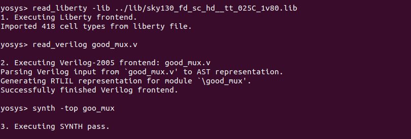

# VSDhdp

# Table of contents
  [Day 1 - Introduction to Verilog RTL design and Synthesis](#day-1---introduction-to-verilog-rtl-design-and-synthesis)
  - Introduction to Yosys and Logic synthesis
  - Labs using Yosys and Sky130 PDKs

# Tools install

### Yosys
```
$ git clone https://github.com/YosysHQ/yosys.git
$ cd yosys-master 
$ sudo apt install make (If make is not installed please install it) 
$ sudo apt-get install build-essential clang bison flex \
    libreadline-dev gawk tcl-dev libffi-dev git \
    graphviz xdot pkg-config python3 libboost-system-dev \
    libboost-python-dev libboost-filesystem-dev zlib1g-dev
$ make 
$ sudo make install

```


### OpenSTA

https://github.com/The-OpenROAD-Project/OpenSTA'

|        | from  |Ubuntu  | On my machine
|    ---|---|---|---
|        |       |18.04.1|  22.04.1
|cmake   | 3.10.2 |3.10.2  |3.22.1
|clang   |9.1.0   |        |14.0.0
|gcc     |3.3.2   |7.3.0   |11.3.0
|tcl     |8.4     |8.6     |8.6.11+1build2
|swig    |1.3.28  |3.0.12  |4.0.2
|bison   |1.35    |3.0.4   |3.8.2
|flex    |2.5.4   |2.6.4   |2.6.4

Basic install, without extra options.


### ngspice

After downloading the tarball from https://sourceforge.net/projects/ngspice/files/ to a local directory, unpack it using:
```
$ tar -zxvf ngspice-37.tar.gz
$ cd ngspice-37
$ mkdir release
$ cd release
$ ../configure  --with-x --with-readline=yes --disable-debug
$ make
$ sudo make install
```


### iverilog
git clone https://github.com/steveicarus/iverilog.git
cd iverilog
 ./configure 
make 
sudo make install

### GTKwave

sudo update
sudo apt install gtkwave

# Day 1 - Introduction to Verilog RTL design and Synthesis
### Iverilog simulator
 The simulator is the tool that will be used to check the design according to the specs. 
 
 
 
 The test benh will contain a Stimulus generator - the design (instantieted) - Stimulus observer. The test bench does not have primary inputs and outputs.
  ```
  `timescale 1ns / 1ps
module tb_good_mux;
	// Inputs
	reg i0,i1,sel;
	// Outputs
	wire y;

        // Instantiate the Unit Under Test (UUT)
	good_mux uut (
		.sel(sel),
		.i0(i0),
		.i1(i1),
		.y(y)
	);

	initial begin
	$dumpfile("tb_good_mux.vcd");
	$dumpvars(0,tb_good_mux);
	// Initialize Inputs
	sel = 0;
	i0 = 0;
	i1 = 0;
	#300 $finish;
	end

always #75 sel = ~sel;
always #10 i0 = ~i0;
always #55 i1 = ~i1;
endmodule

  ```
 The output of the iverilog is a `.vcd` file and gtkwave will be used to generate the waveforms and to have it in visual format.
  
 Folder structure of the git clone:
    - lib - will contain sky130 standard cell library 
    - my_lib/verilog_models - will contain standard cell verilog model
    - verilog_files  -containes the lab experiments source files
  
  Running iverilog  (11.0-1.11) and gtkwave (3.3.104-1build1): 
  
    
  
### Yosys and Logic synthesis
  A synthesizer is used to convert behavioral design RTL to a netlist(gate level=gates and connections), using a specific technology library. 
  
    
  
  To verify the generated netlist we run again verilog with the netlist content instead of the RTL file -> the waveforms should be the same - the same test bench can be used.
  Front end library contains a collection of gate components like nand, nor etc. with different configurations, working speed or other physical parameters. 
  
  This aspects will solve issues related to SETUP and HOLD time or performance .  
  The propagation delay is influence also by the charging and discharging the capacitance/loads , this will need a optimization of the cell size and cell number. 
  
  Faster cells - less delay,wider transistor,  more area and power, possible hold violations
  Slower cells - more delay,narrow transistor, less area and power, setup and performance violations 
  
  
  
  The image is a representation of the RTL to the synthesized netlist with specific library components.
  
  
  
  
  - read_liberty filename -read specific sky130 library  
  - read_verilog filename - read the verilog design file , for more file we need to read all files
  - synth option modulename - this comand is telling what is the module we need to synthesize
  - abc -liberty fileanme - generate the gate netlist , the logic design will be realized in format of the gates specified in the library 
  
#Aknolegment:

  
  
  
  
 
  
