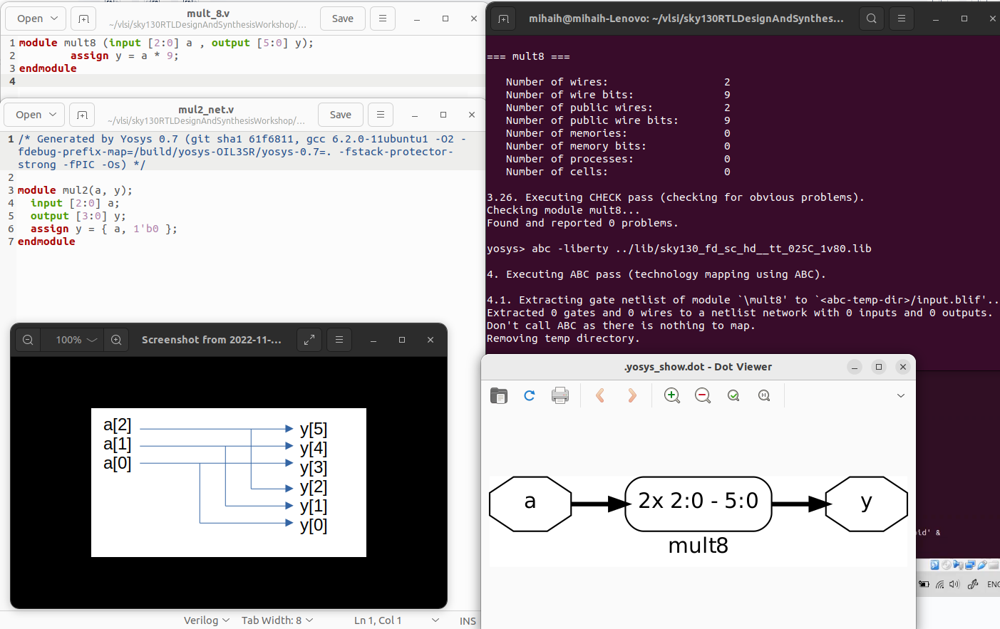
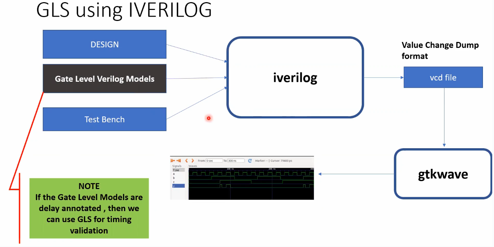
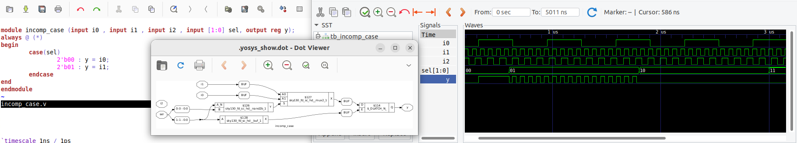
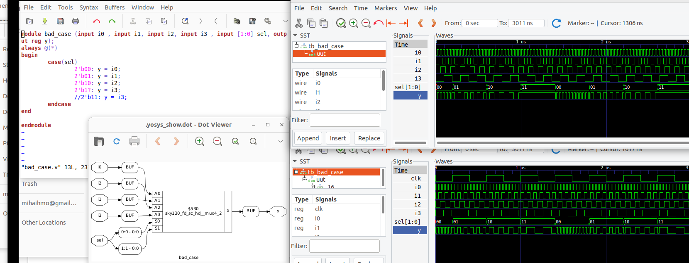

# VSD Hardware Digital Program -Digital 

# Table of contents
  + [Tools install](#tools-install)
  + [Day 1 - Introduction to Verilog RTL design and Synthesis](#day-1---introduction-to-verilog-rtl-design-and-synthesis)
	  - Introduction to iverilog and gtkwave for simualtions + labs
	  - Introduction to Yosys and Logic synthesis + labs
  + [Day 2 - Timing libs(QTMs/ETMs), hierarchical vs flat synthesis and efficient flop coding styles](#day-2---timing-libsqtmsetms-hierarchical-vs-flat-synthesis-and-efficient-flop-coding-styles)
	 - Introduction to .libs
	 - Hierarchical vs Flat Synthesis
	 - Various Flop Coding Styles 
  + [Day 3 - Combinational and sequential optimizations](#day-3---combinational-and-sequential-optimizations)
 	 - Introduction to optimizations
	 - Combinational logic optimizations
	 - Sequential logic optimizations
	 - Sequential optimizations for unused outputs
  + [Day 4 - GLS, blocking vs non-blocking and Synthesis-Simulation mismatch](#day-4---gls-blocking-vs-non-blocking-and-synthesis-simulation-mismatch)
 	 - GLS, Synthesis-Simulation mismatch and Blocking/Non-blocking statements
 	 - Labs on GLS and Synthesis-Simulation Mismatch, synth-sim mismatch for blocking statement
  + [Day 5 - Optimization in synthesis](#day-5---optimization-in-synthesis) 
         - If Case constructs
	 - for loop and for generate


# Tools install

### Yosys
```
$ git clone https://github.com/YosysHQ/yosys.git
$ cd yosys-master 
$ sudo apt install make (If make is not installed please install it) 
$ sudo apt-get install build-essential clang bison flex \
    libreadline-dev gawk tcl-dev libffi-dev git \
    graphviz xdot pkg-config python3 libboost-system-dev \
    libboost-python-dev libboost-filesystem-dev zlib1g-dev
$ make 
$ sudo make install

```


### OpenSTA

https://github.com/The-OpenROAD-Project/OpenSTA'

|        | from  |Ubuntu  | On my machine
|    ---|---|---|---
|        |       |18.04.1|  22.04.1
|cmake   | 3.10.2 |3.10.2  |3.22.1
|clang   |9.1.0   |        |14.0.0
|gcc     |3.3.2   |7.3.0   |11.3.0
|tcl     |8.4     |8.6     |8.6.11+1build2
|swig    |1.3.28  |3.0.12  |4.0.2
|bison   |1.35    |3.0.4   |3.8.2
|flex    |2.5.4   |2.6.4   |2.6.4

Basic install, without extra options.


### ngspice

After downloading the tarball from https://sourceforge.net/projects/ngspice/files/ to a local directory, unpack it using:
```
$ tar -zxvf ngspice-37.tar.gz
$ cd ngspice-37
$ mkdir release
$ cd release
$ ../configure  --with-x --with-readline=yes --disable-debug
$ make
$ sudo make install
```


### iverilog
git clone https://github.com/steveicarus/iverilog.git
cd iverilog
 ./configure 
make 
sudo make install

### GTKwave

sudo update
sudo apt install gtkwave

# Day 1 - Introduction to Verilog RTL design and Synthesis
### Iverilog simulator
 The simulator is the tool that will be used to check the design according to the specs. 
 
 
 
 The test benh will contain a Stimulus generator - the design (instantieted) - Stimulus observer. The test bench does not have primary inputs and outputs.
  ```
  `timescale 1ns / 1ps
module tb_good_mux;
	// Inputs
	reg i0,i1,sel;
	// Outputs
	wire y;

        // Instantiate the Unit Under Test (UUT)
	good_mux uut (
		.sel(sel),
		.i0(i0),
		.i1(i1),
		.y(y)
	);

	initial begin
	$dumpfile("tb_good_mux.vcd");
	$dumpvars(0,tb_good_mux);
	// Initialize Inputs
	sel = 0;
	i0 = 0;
	i1 = 0;
	#300 $finish;
	end

always #75 sel = ~sel;
always #10 i0 = ~i0;
always #55 i1 = ~i1;
endmodule

  ```
 The output of the iverilog is a `.vcd` file and gtkwave will be used to generate the waveforms and to have it in visual format.
  
 Folder structure of the git clone:
    - lib - will contain sky130 standard cell library 
    - my_lib/verilog_models - will contain standard cell verilog model
    - verilog_files  -containes the lab experiments source files
  
  Running iverilog  (11.0-1.11) and gtkwave (3.3.104-1build1): 
  
    
  
### Yosys and Logic synthesis
  A synthesizer is used to convert behavioral design RTL to a netlist(gate level=gates and connections), using a specific technology library. 
  
    
  
  To verify the generated netlist we run again verilog with the netlist content instead of the RTL file -> the waveforms should be the same - the same test bench can be used.
  Front end library contains a collection of gate components like nand, nor etc. with different configurations, working speed or other physical parameters. 
  
  This aspects will solve issues related to SETUP and HOLD time or performance .  
  The propagation delay is influence also by the charging and discharging the capacitance/loads , this will need a optimization of the cell size and cell number. 
  
  Faster cells - less delay,wider transistor,  more area and power, possible hold violations
  Slower cells - more delay,narrow transistor, less area and power, setup and performance violations 
  
  
  
  The image is a representation of the RTL to the synthesized netlist with specific library components.
  
  
  
  
  - read_liberty -lib filename -read specific sky130 library  
  - read_verilog filename - read the verilog design file , for more file we need to read all files
  - synth option modulename - this command is telling what is the module we need to synthesize
  - abc -liberty filename - generate the gate netlist , the logic design will be realized in format of the gates specified in the library 
  
  
  
  - write_verilog filename - will generate the verilog file from the netlist , `-noattr` - will reduce the informaion in the file

# Day 2 - Timing libs(QTMs/ETMs), hierarchical vs flat synthesis and efficient flop coding styles
### Understanding the libs content 

  Library naming `sky130_fd_sc_hd__tt_025C_1v80`:
   -`sky130_fd_sc_hd : process name
  PVT variations
   - `tt` - typical process from (slow, fast , typical) 
   - `025C` - temperature
   - '1V8' - voltage
  
  Other info:
   - technology name 
   -`cell` construct will define all the cells  
   - features off the cell : e.g leakage power in certain conditions, pin parameter, area , timing etc.
  
  
  
### Hierarchical vs Flat Synthesis
  
  A hierarchical design contains `sub-modules` identified in the picture as `Ux` components 
  
  
  
  Sometime the RTL generated from netlist can have different gates than the original verilog code but overall has the same function. 
  The tools will always want to optimize the circuit for example a NOR+INV = NAND .
  Usually when a stacked PMOS can be replaced buy circuit with stacked NMOS the circuit will be more optimized  
  
  `flatten` command is eliminating the `sub_modules` and will generate just a bih module with the same elements.
  
  Sub-module instantiation `synth -top module_name`:
  - the `Ux sub-modules` are not seen anymore in the diagram or in the code
  - preferred when we have multiple instances of same module so we synthesize just one and copy the generated netlist in the main netlist  
  - massive design will not work optimized for the tools so can be divided in smaller circuits
  
  
  
### Flop Coding Styles and optimization
   Flops are needed to eliminate the possible glitches generated by the different propagation delays of the signals in the combinational circuits or in between them. The flops are like storage elements.
  The flops will restrict the glitches propagation because the flop output will change just on the edge of a clock , so even the input of the flop will be glitchy the output will be stable - the input of the comb circuit will be stable so also the output will be more stable .
 


 The value of the flop must be known all the time for this signals like `reset` or `set` are used to control the initial state . This can be synchronous or asynchronous. 


Example of some HW optimizations:
`2*a[2:0] = y[3:0]` is actually just appending a `1'b0` to the `a[2:0]`.

`y=9*a`
can be considered  8*a+1*a = y[5:0]  -> appending 000 to a[2:0] + 1*a -> a000+ a =aa
This can be realized just by wiring.



# Day 3 - Combinational and sequential optimizations 
### Introduction to optimizations
This is used usally to have an optimized PPA.
Constant propagation example :
Y=((AB)+C)' in case A=0 -> Y=((0)+C)' = (C)'
The propagation of a constant can generate a more optimized combination different than initial one: 6 vs 2 transistors used.


Boolean optimization example : 
assign y=a?(b?c:(c?a:0)):(!c)  
y=a'c'+a[bc+b'ac]=a'c'+abc+ab'c = a'c'+ac[b+b'] =a'c'+ac= a xor c
This is an example of const propag, k-map and boolean optimization.


### Sequential  optimization:
State optimization - Optimization of unused state

Cloning - When flops are far away between them , the 'driving' flop A can be doubled so the overall delays between B and C can be eliminated .


Re-timing: 
Lets assume the circuit below and Clk to Q delay Setup and hold time ~ 0.


If initial we have 2 logic cells that can work at 200Mhz and 500Mhz and overall time needed to perform 2 states is ~7ns - the max working frequency will be limited to lower 200Mhz. 
If possible the logic can be change to move some parts from first cell to second one and to keep the ~7ns execution time. But with more comparable working frequencies per cell we can optimize the overall working frequency 
Labs:
When running the examples the command to execute optimization is : `opt_clean -purge`


Example of a mux with an input tight to 0 -> y=a'0+b =ab
```
module opt_check (input a , input b , output y);
	assign y = a?b:0;
endmodule
```
Here you can see that was optimized to an AND gate


- Opt_check3 example:
```
module opt_check3 (input a , input b, input c , output y);
	assign y = a?(c?b:0):0;
endmodule
```


a'+a[c'0+cb] = 0+abc = abc

- Opt_check4 example:
```
module opt_check4 (input a , input b , input c , output y);
 assign y = a?(b?(a & c ):c):(!c);
endmodule
```
y= [[ac]b+b'c]a+a'c' = abc+ab'c+a'c' = ac[b+b']+a'c' = ac+a'c'


- Multiple_module_opt2 example :
The code , hierarchical and flatten design :


Optimized design :


Sequential logic optimization:

In some cases libraries wil contain separated libraries for flops and lathes (sequential circuits)   and separate combinational circuits.

-`dfflibmap -liberty filepath` - like in this cases here we need to use the command to map the sequential circuits from the library .


First example is a flop with `reset` and second with `set' behavior.
In the first circuit we see the a flop was infered (#DFF_PP0) and in second circuit was not identified any.

The second circuit is an example of seq constant optimization.

Dff_const3:
An example of circuit containing flops with constant value at the input that will not be optimized because the circuit will toggle based on reset/set and clock states. So the constant value from the input will not propagate at the output of the flop.
This is visible in the waveforms were Q and Q1 are toggling because of values sampled on clock edge.  


In the diagram we can see the flops , one with reset and one with set . The inverters are generated because the cells are active low and the code is used like an active high signal for reset and set.

Here can be seen use cases with different set/reset combination:


###    Sequential optimizations for unused outputs

The logic that will not affect the output will be optimized , eliminated.
The following example show:
For the first code q is affected just by count[0] so the circuit will be simple.

In case the counter is using all 3 bits to the output will contain all flops that affect the 3 bits.


# Day 4 - GLS, blocking vs non-blocking and Synthesis-Simulation mismatch
Gate level syntesis is needed because :
- we need to verify the correctness of the design after synthesis 
- RTL does not contain the notion of timing so now with the specific gate implemenation the design timing must be met
- GLS needs to run with delay annotation ( for this the gate level models must be timing aware)



Syntesis Mismatch 
- Missing sensitivity list: Simulators work based on "activity " ( a change in input will triger a change in output ). There are cases when for "always" sblocks are specified less signals that will trigger the changes in the design. So in simulation will not behave as expected.

- Blocking vs Non-Blocking Assignment: inside always block 
	 - `=` Blocking :Execute the statements in order it is written - first statement is evaluated before second statement
	 - `<=`Non Blocking : Parallel evaluation - executes all "right hand" statements and assigns to "left hand" statement (e.g: 'a<=b&c;') 
	 - It si recommended non blocking for sequential circuits, avoid as much as possible and double check your design on paper 


- Non Standard verilog coding 

Lab, running iverilog on GLS :

`iverilog verilog_model_std_cell(2 files in our case)  net_list test_bench `

`iverilog ../my_lib/verilog_model/primitives.v ../my_lib/verilog_model/sky130_fd_sc_hd.v ternary_operator_mux_net.v tb_ternary_operator_mux.v `

Ternary example: 
```
module ternary_operator_mux (input i0 , input i1 , input sel , output y);
	assign y = sel?i1:i0;
	endmodule
```


For synthesis mismatch behavior : 
```
module bad_mux (input i0 , input i1 , input sel , output reg y);
always @ (sel)
begin
	if(sel)
		y <= i1;
	else 
		y <= i0;
end
endmodule
```
In the RTL simulation clearly we can see a bad mux behavior , a flop behavior. 
In synthesized netlist simulation we see a good mux behavior. So a mismatch between them. 


Blocking caveat: Intended design is `y = (a|b)&c' , code is...
```
module blocking_caveat (input a , input b , input  c, output reg d); 
reg x;
always @ (*)
begin
	d = x & c;
	x = a | b;
end
endmodule
```
results are: 


# Day 5 - Optimization in synthesis
### If, Case constructs
```
if <cond >
begin
...
end
else  
      if <cond2>
      begin
      ...
      end
      else
      begin
      ....
      end
```
If creates a priority logic , so the HW will be cascade of MUXes 
The issues that can appear using the if construct is called "Inferred Latches" , I do not intend to generate a lath but coding style will generate one. Usually when we use "Incomplete IF" 


There are some cases that can be intended - example a counter:
```
reg[2:0] count
always @(posedge clk, posedge reset)
begin
   if (reset)
      count<=3'b000;
   elseif(en)
      count <=count+1;
   end
```


In this case if there is no enable the circuit should latch on the previous value.
In the "conbinational" circuits we do not need to have latches , "sequential" ciruits will have latches .

In the following examples we can see the wrong usage of if.
First example implements a combo circuit connected to a latch and second one a simple latch .


### Case statement :
if, case are used inside always block , whatever variable you want to assign in  shpuld be a register variable
```
reg y
alwasy @(*)
begin                                       |\
 case (sel)                             c1 -|0|
 	2'b00: begin                        | |
	      C1 ...                    c2 -|1|- y
	       end                          | |
	2'b01: beging                   ...-|n|
	      C2 ...                        |/    
		end                          |
        ...                                 sel
  endcase
 end
 ```
The HW generated is a mux with `Cx`- cases assigned to `y`. 
 
Caveats with case:
Incomplete cases:
```
reg [1:0] sel
alwasy @(*)
begin                                      
  case (sel)                             
 	2'b00: begin                        
	      C1 ...                    
	       end                        
	2'b01: beging                   
	      C2 ...                        
		end                          
                                           
  endcase
 end
 ```
 In case we have incomplete cases (ex just c1 and c2) we generate inferred latches . For this the remained cases must be coded with default states.
 


Lab example: we see that on `sel=00` `y` takes the values for `10` and `11` it latches. 
We see the mux and the latch generated after synthesis .



A correct example: we can see no latches inferred and the cases `10` and `11` follow the `i2` input. 


Partial assigments in case
```
reg[1:0] sel;
reg x, y;
alwasys @(*)
begin
	case(sel)
		2'b00: begin
			x=a;
			y=b;
		        end
		2'b01: begin
			x=x;
			end
		default: begin
			x=d;
			y=b;
		        end
	endcase
```
In this case '`y` was not assygnet for `2'b00`. -> assign all the outputs in all the segmnets.


Lab example: `y` is defined correctly but `x` has no assignment for `sel=b'01` . Enable condition for the latch is `sel[1]'.sel[0]'+sel[1]=sel[1]+sel[0]'` - redundancy theorem.  


Boolean expression of the synthesized circuit: !!!!

Additional we should not have overlaping case statements (ex: `2'b10` and `2b'1?` `?` means indifferent). This will confuse the tools.



In the first waveform (the RTL version) we see for `sel=b'11` `y` gets a random value.
In the second waveform (the synthesized netlist) the for `sel=b'11` `y=i3`.  

### for loop and for generate

There are 2 looping contructs:
 - for loop - used in allways - used for evaluating expresions (not for generating/instantiate HW) 
 - generate for loop - outside allways - used to instantiate HW , for example multiple times (and gate x times)

For very wide mux/demux will simplify some circuit code.
32:1 MUX
```
alwasys @(*)                               | integer i; inp[31:0]
begin                                      | alwasys @(*)
	case(sel)                          | begin 
		5'b00000: y=i0             |    for (i=0; i<32; i=i+1) begin
		5'b00001: y=i1             |       if(i==sel)
		5'b00010: y=i2             |            y=inp[i];
		.....                      |     end
		5'b11111: y=i31            | end
		
		end
	endcase
```
1x8 DEMUX

```
integer i; inp[31:0]
alwasys @(*)
begin 
    op_bus[7:0]=8'b0;  ( initialization) 
    for (i=0; i<32; i=i+1) begin
	if (i==sel)
	   op_bus[i]=input
	end
end
```
For several instancies and gate 

```
and u_and1 (.a();.b();.y());     | genvar i;
and u_and2 (.a();.b();.y());     |   generate 
....                             |       for (i=0; i<8; i=i+1) begin
....                             |         and u_and (.a(ina[i]);.b(inb[i]);.y(oy[i]));
and u_andn (.a();.b();.y());     |        end
                                 |   endgenerate
```

Use case Ripple Carry ADDER(RCA) - it will use replicated HW blocks.


Labs: elegant way to write 

```
module mux_generate (input i0 , input i1, input i2 ,            | \
input i3 , input [1:0] sel  , output reg y);               i0---|   \
wire [3:0] i_int;                                               |   |
assign i_int = {i3,i2,i1,i0};                              i1---|   | -- y
integer k;                                                      |   |
always @ (*)                                               i2---|   |
 begin                                                          |   |
   for(k = 0; k < 4; k=k+1) begin                          i3---|  /
	if(k == sel)                                            | /|
		y = i_int[k];                                    | |
     end                                                   sel[1]   sel[0]
  end
endmodule
```


Demux case vs for

```
module demux_case (output o0 , output o1, output o2 , output o3, output o4, output o5, output o6 , output o7 , input [2:0] sel  , input i);
reg [7:0]y_int;
assign {o7,o6,o5,o4,o3,o2,o1,o0} = y_int;
integer k;                                                            /|
always @ (*)                                                         / |
begin                                                               |  |---y0
y_int = 8'b0;             # initialization will eliminate latches   |  |---y1
	case(sel)                                                   |  |---y2
		3'b000 : y_int[0] = i;                         i ---|  |---y3
		3'b001 : y_int[1] = i;                              |  |---y4
		3'b010 : y_int[2] = i;                              |  |---y5
		3'b011 : y_int[3] = i;                              \  |---y6
		3'b100 : y_int[4] = i;                              |\ |---y7
		3'b101 : y_int[5] = i;                              |  
		3'b110 : y_int[6] = i;                            sel[2:0]
		3'b111 : y_int[7] = i;                       
	endcase

end
endmodule
```


```
module demux_generate (output o0 , output o1, output o2 , output o3, output o4, output o5, output o6 , output o7 , input [2:0] sel  , input i);
reg [7:0]y_int;
assign {o7,o6,o5,o4,o3,o2,o1,o0} = y_int;
integer k;
always @ (*)
begin
y_int = 8'b0;
for(k = 0; k < 8; k++) begin
	if(k == sel)
		y_int[k] = i;
end
end
endmodule

```


# Acknowledgements
- [Kunal Ghosh](https://github.com/kunalg123)
- [VLSI System Design](https://www.vlsisystemdesign.com/)
- [VSD-IAT](https://vsdiat.com/)

  
  
  
  
 
  
