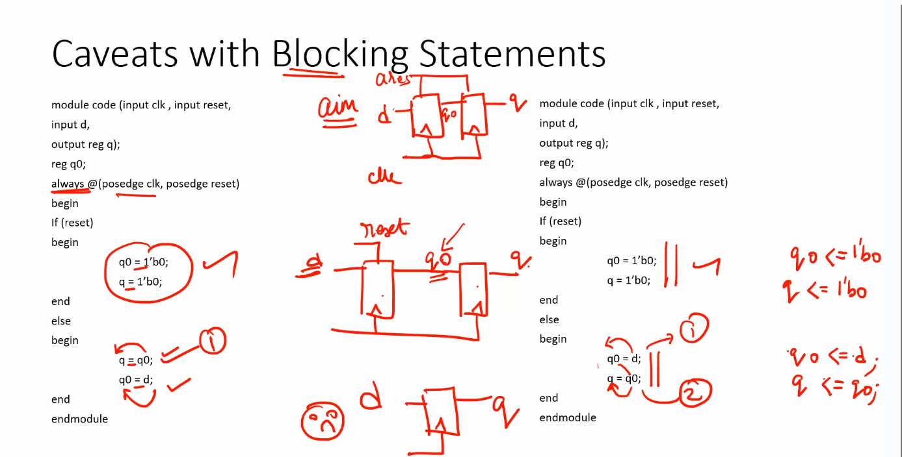
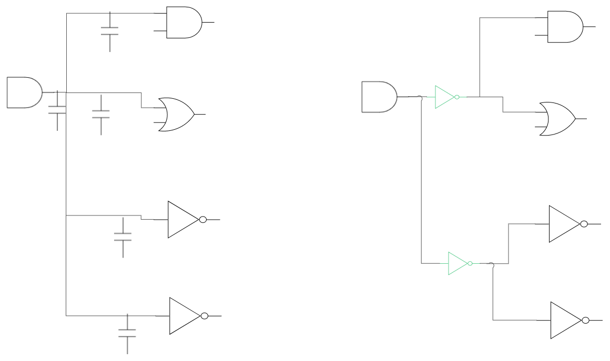
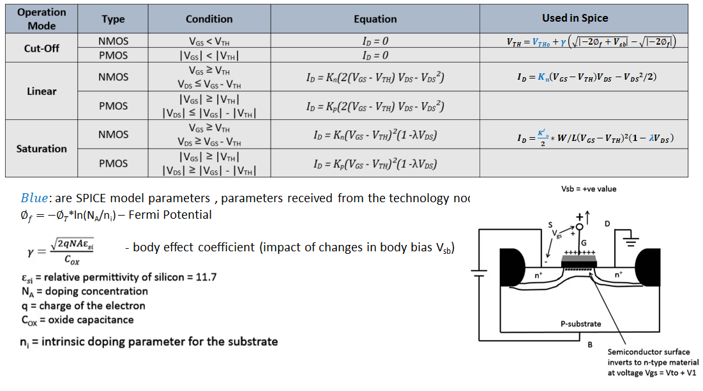
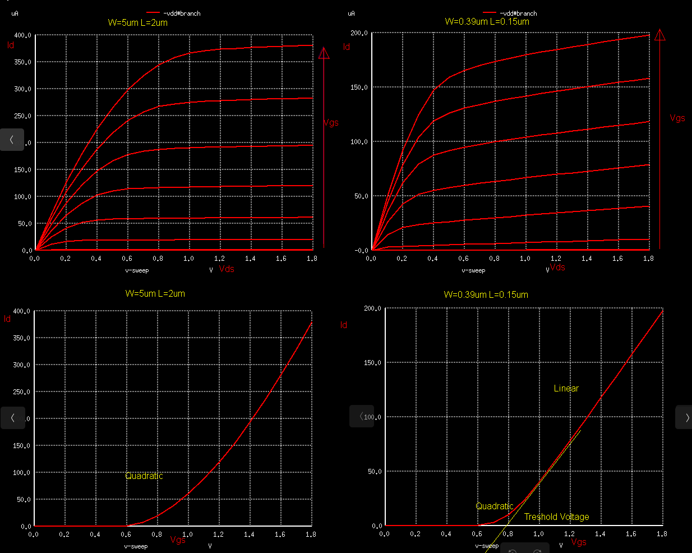
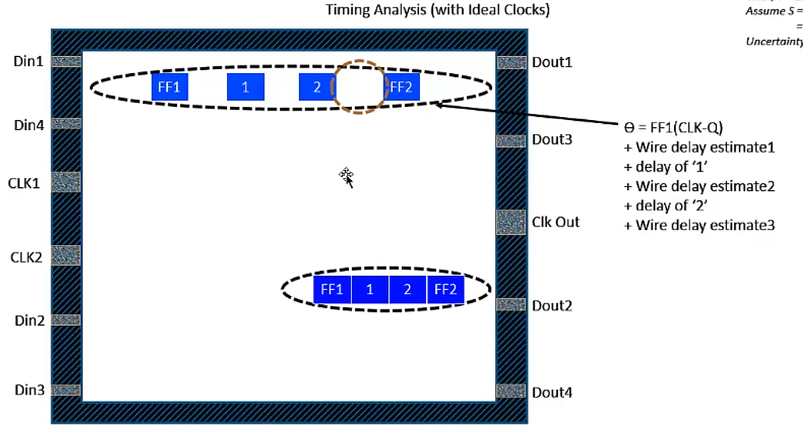
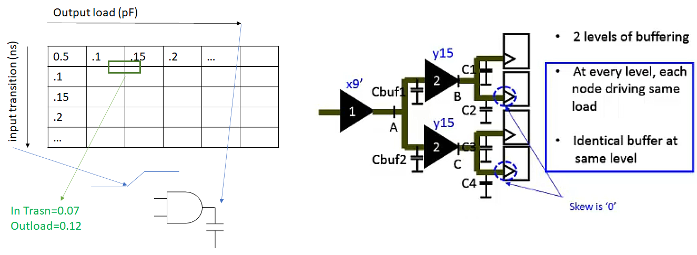

# VSD Hardware Digital Program -Digital 

# Table of contents
  + [Project implementaion: VSDMemSoC](https://github.com/MihaiHMO/VSDhdp/blob/main/VSDMemSoC.md) 
  + [Tools installation](#tools-install)  
  	- [Yosys-gate level synthesis](#yosys)
	- [OpenSTA - static timing anlysis ](#opensta)
	- [ngspice - electrical simulation](#ngspice)
	- [iverilog/ GTKwave - Verilog HDL and waveform viewer ](#iverilog)
	- [OpenLane](#openlane)
	- [Magic - VLSI layout tool](#magic)
  + [ASIC Design flow](#asic-design-flow)
  + [Day 1- Introduction to Verilog RTL design and Synthesis](#day-1---introduction-to-verilog-rtl-design-and-synthesis)
	- Introduction to iverilog and gtkwave for simualtions + labs
	- Introduction to Yosys and Logic synthesis + labs
  + [Day 2 - Timing libs(QTMs/ETMs), hierarchical vs flat synthesis and efficient flop coding styles](#day-2---timing-libsqtmsetms-hierarchical-vs-flat-synthesis-and-efficient-flop-coding-styles)
	- Introduction to .libs
	- Hierarchical vs Flat Synthesis
	- Various Flop Coding Styles
  + [Day 3 - Combinational and sequential optimizations](#day-3---combinational-and-sequential-optimizations)
	- Introduction to optimizations
	- Combinational logic optimizations
	- Sequential logic optimizations
	- Sequential optimizations for unused outputs
  + [Day 4 - GLS, blocking vs non-blocking and Synthesis-Simulation mismatch](#day-4---gls-blocking-vs-non-blocking-and-synthesis-simulation-mismatch)
	- GLS, Synthesis-Simulation mismatch and Blocking/Non-blocking statements
	- Labs on GLS and Synthesis-Simulation Mismatch, synth-sim mismatch for blocking statement
  + [Day 5 - Optimization in synthesis](#day-5---optimization-in-synthesis)
	- If Case constructs
	- for loop and for generate
  + [Day 7 - Basic SDC constraints](#day-7---basic-sdc-constraints)
	- Basics of STA
	- Delays and Timing Arcs
	- Constraining the Design
	- What is STA , setup , hold quick recap
	- What are constraints
	- Constraining the Reg2Reg , Reg2IO , IO2Reg Paths
	- Input transition and OutputLoad and its effects on IO delays  
  + [Day 8 - Advanced SDC Constraints](#day-8---advanced-sdc-constraints)
	- Clock Skew and Clock Jitter, its modelling in DC  
	- Writing SDCs [Synopsys Design Constraints]  
	- Creating Clocks  
	- Querying Cells  
	- Specifying IO Delays  
	- Specifying Clock Waveforms  
	- Generated Clocks  
	- Multi Clock Design  
	- False Paths  
  + [Day 10-11 - Introduction to STA and importance of MOSFETs in STA/EDA](#day-10-11-introduction-to-sta-and-importance-of-mosfets-in-staeda)
	- Basics of NMOS Drain current (Id) vs Drain-to-source Voltage (Vds)
	- NMOS resistive region and saturation region of operation
	- Introduction to Circuit Design and SPICE simulations 
  + [Day 12-15 - Basics of CMOS inverter](#day-12-15-basics-of-cmos-inverter)
	- CMOS voltage transfer characteristics (VTC)
	- Switching threshold and dynamic simulations
	- Static behavior evaluation – Switching Threshold
	- Static behavior evaluation – Noise margin
	- Static behavior evaluation – Power supply variation
	- Static behavior evaluation – Device variation  
  + [Day 18-20 Physical design](#physical-design)  
  	- Oen-source EDA, OpenLANE and Sky130 PDK
	- Floorplan and introduction to library cells
	- Design and characterize one library cell using Layout tool and spice simulator
	- Pre-layout timing analysis and importance of good clock tree
	- Final steps for RTL2GDS

# Tools install

### Yosys
```
$ git clone https://github.com/YosysHQ/yosys.git
$ cd yosys-master 
$ sudo apt install make (If make is not installed please install it) 
$ sudo apt-get install build-essential clang bison flex \
    libreadline-dev gawk tcl-dev libffi-dev git \
    graphviz xdot pkg-config python3 libboost-system-dev \
    libboost-python-dev libboost-filesystem-dev zlib1g-dev
$ make 
$ sudo make install

```


### OpenSTA

https://github.com/The-OpenROAD-Project/OpenSTA

|        | from  |Ubuntu  | On my machine
|    ---|---|---|---
|        |       |18.04.1|  22.04.1
|cmake   | 3.10.2 |3.10.2  |3.22.1
|clang   |9.1.0   |        |14.0.0
|gcc     |3.3.2   |7.3.0   |11.3.0
|tcl     |8.4     |8.6     |8.6.11+1build2
|swig    |1.3.28  |3.0.12  |4.0.2
|bison   |1.35    |3.0.4   |3.8.2
|flex    |2.5.4   |2.6.4   |2.6.4

Basic install, without extra options.


### ngspice 
Packages Prerequisite :https://sourceforge.net/p/ngspice/bugs/263/#27fb
automake, libtool,
libxaw7-dev,
flex, bison,
libeditline-dev,
libncurses5-dev,

After downloading the tarball from https://sourceforge.net/projects/ngspice/files/ to a local directory, unpack it using:
```
$ tar -zxvf ngspice-37.tar.gz
$ cd ngspice-37
$ mkdir release
$ cd release
$ ../configure  --with-x --with-readline=yes --disable-debug
$ make
$ sudo make install
```


### iverilog
git clone https://github.com/steveicarus/iverilog.git
cd iverilog
 ./configure 
make 
sudo make install

### GTKwave

sudo update
sudo apt install gtkwave

### OpenLane 
OpenLane is an automated RTL to GDSII flow based on several components including OpenROAD, Yosys, Magic, Netgen, CVC, SPEF-Extractor, CU-GR, Klayout and a number of custom scripts for design exploration and optimization. The flow performs full ASIC implementation steps from RTL all the way down to GDSII.  
More about Openlane at : https://github.com/The-OpenROAD-Project/OpenLane  

`$   apt install -y build-essential python3 python3-venv python3-pip`  

Docker installation process: https://docs.docker.com/engine/install/ubuntu/

Goto home directory->  
```
$   git clone https://github.com/The-OpenROAD-Project/OpenLane.git
$   cd OpenLane/
$   sudo make
```
To test the open lane:
`sudo make test`  
It takes approximate time of 5min to complete. After 43 steps, if it ended with saying Basic test passed then open lane installed succesfully.  

### Magic  

More about magic at http://opencircuitdesign.com/magic/index.html  

Run following commands one by one to fulfill the system requirement.  

```
$   sudo apt-get install m4
$   sudo apt-get install tcsh
$   sudo apt-get install csh
$   sudo apt-get install libx11-dev
$   sudo apt-get install tcl-dev tk-dev
$   sudo apt-get install libcairo2-dev
$   sudo apt-get install mesa-common-dev libglu1-mesa-dev
$   sudo apt-get install libncurses-dev
```  
To install magic goto home directory   
```
$   git clone https://github.com/RTimothyEdwards/magic
$   cd magic/
$   ./configure
$   sudo make
$   sudo make install
```
Type magic terminal to check whether it installed succesfully or not. type exit to exit magic.  

# ASIC Design flow


**_!!! The workshop will cover steps 3 to 9 !!!_**  

From conception to product, the ASIC design flow is an iterative process that is not static for every design. The details of the flow may change depending on ECO’s, IP requirements, DFT insertion, and SDC constraints, however the base concepts still remain. The flow can be broken down into 11 steps:

1. Architectural Design – A system engineer will provide the VLSI engineer with specifications for the system that are determined through physical constraints. The VLSI engineer will be required to design a circuit that meets these constraints at a microarchitecture modeling level.

2. RTL Design/Behavioral Modeling (iverilog) – RTL design and behavioral modeling are performed with a hardware description language (HDL). EDA tools will use the HDL to perform mapping of higher-level components to the transistor level needed for physical implementation. HDL modeling is normally performed using either Verilog or VHDL. One of two design methods may be employed while creating the HDL of a microarchitecture:  
	a. 	RTL Design – provides an abstraction of the digital   circuit using:Combinational logic, Registers, Modules (IP’s or Soft Macros)  
	b. 	Behavioral Modeling – Allows the microarchitecture modeling to be performed with behavior-based modeling in HDL. This method bridges the gap between C and HDL allowing HDL design to be performed  

3. RTL Verification - Behavioral verification of design (GTKwave)

4. DFT Insertion - Design-for-Test Circuit Insertion

5. Logic Synthesis – Logic synthesis uses the RTL netlist to perform HDL technology mapping. The synthesis process is normally performed in two major steps:
	 - GTECH Mapping – Consists of mapping the HDL netlist to generic gates what are used to perform logical optimization based on AIGERs and other topologies created from the generic mapped netlist.
	- Technology Mapping – Consists of mapping the post-optimized GTECH netlist to standard cells described in the PDK
  
Standard Cells – Standard cells are fixed height and a multiple of unit size width. This width is an integer multiple of the SITE size or the PR boundary. Each standard cell comes with SPICE, HDL, liberty, layout (detailed and abstract) files used by different tools at different stages in the RTL2GDS flow.

6. Post-Synthesis STA Analysis: Performs setup analysis on different path groups.

7. Floorplanning – Goal is to plan the silicon area and create a robust power distribution network (PDN) to power each of the individual components of the synthesized netlist. In addition, macro placement and blockages must be defined before placement occurs to ensure a legalized GDS file. In power planning we create the ring which is connected to the pads which brings power around the edges of the chip. We also include power straps to bring power to the middle of the chip using higher metal layers which reduces IR drop and electro-migration problem.

8. Placement – Place the standard cells on the floorplane rows, aligned with sites defined in the technology lef file. Placement is done in two steps: Global and Detailed. In Global placement tries to find optimal position for all cells but they may be overlapping and not aligned to rows, detailed placement takes the global placement and legalizes all of the placements trying to adhere to what the global placement wants.

9. CTS – Clock tree synteshsis is used to create the clock distribution network that is used to deliver the clock to all sequential elements. The main goal is to create a network with minimal skew across the chip. H-trees are a common network topology that is used to achieve this goal.

10. Routing – Implements the interconnect system between standard cells using the remaining available metal layers after CTS and PDN generation. The routing is performed on routing grids to ensure minimal DRC errors.

11. GDSII Generation


# Day 1 - Introduction to Verilog RTL design and Synthesis
### Iverilog simulator
 The simulator is the tool that will be used to check the design according to the specs. 
 
 
 
 The test benh will contain a Stimulus generator - the design (instantieted) - Stimulus observer. The test bench does not have primary inputs and outputs.
  ```
  `timescale 1ns / 1ps
module tb_good_mux;
	// Inputs
	reg i0,i1,sel;
	// Outputs
	wire y;

        // Instantiate the Unit Under Test (UUT)
	good_mux uut (
		.sel(sel),
		.i0(i0),
		.i1(i1),
		.y(y)
	);

	initial begin
	$dumpfile("tb_good_mux.vcd");
	$dumpvars(0,tb_good_mux);
	// Initialize Inputs
	sel = 0;
	i0 = 0;
	i1 = 0;
	#300 $finish;
	end

always #75 sel = ~sel;
always #10 i0 = ~i0;
always #55 i1 = ~i1;
endmodule

  ```
 The output of the iverilog is a `.vcd` file and gtkwave will be used to generate the waveforms and to have it in visual format.
  
 Folder structure of the git clone:
    - lib - will contain sky130 standard cell library 
    - my_lib/verilog_models - will contain standard cell verilog model
    - verilog_files  -containes the lab experiments source files
  
  Running iverilog  (11.0-1.11) and gtkwave (3.3.104-1build1): 
  
    
  
### Yosys and Logic synthesis
  A synthesizer is used to convert behavioral design RTL to a netlist(gate level=gates and connections), using a specific technology library. 
  
    
  
  To verify the generated netlist we run again verilog with the netlist content instead of the RTL file -> the waveforms should be the same - the same test bench can be used.
  Front end library contains a collection of gate components like nand, nor etc. with different configurations, working speed or other physical parameters. 
  
  This aspects will solve issues related to SETUP and HOLD time or performance .  
  The propagation delay is influence also by the charging and discharging the capacitance/loads , this will need a optimization of the cell size and cell number. 
  
  Faster cells - less delay,wider transistor,  more area and power, possible hold violations
  Slower cells - more delay,narrow transistor, less area and power, setup and performance violations 
  
  
  
  The image is a representation of the RTL to the synthesized netlist with specific library components.
  
  
  
  
  - read_liberty -lib filename -read specific sky130 library  
  - read_verilog filename - read the verilog design file , for more file we need to read all files
  - synth option modulename - this command is telling what is the module we need to synthesize
  - abc -liberty filename - generate the gate netlist , the logic design will be realized in format of the gates specified in the library 
  
  
  
  - write_verilog filename - will generate the verilog file from the netlist , `-noattr` - will reduce the informaion in the file

# Day 2 - Timing libs(QTMs/ETMs), hierarchical vs flat synthesis and efficient flop coding styles
### Understanding the libs content 

  Library naming `sky130_fd_sc_hd__tt_025C_1v80`:  
   - `sky130_fd_sc_hd` : process name  
  PVT variations :  
   - `tt` - typical process from (slow, fast , typical) 
   - `025C` - temperature
   - `1V8` - voltage
  
  Other info:
   - technology name 
   -`cell` construct will define all the cells  
   - features off the cell : e.g leakage power in certain conditions, pin parameter, area , timing etc.
  
  
  
### Hierarchical vs Flat Synthesis
  
  A hierarchical design contains `sub-modules` identified in the picture as `Ux` components 
  
  
  
  Sometime the RTL generated from netlist can have different gates than the original verilog code but overall has the same function. 
  The tools will always want to optimize the circuit for example a NOR+INV = NAND .
  Usually when a stacked PMOS can be replaced buy circuit with stacked NMOS the circuit will be more optimized  
  
  `flatten` command is eliminating the `sub_modules` and will generate just a bih module with the same elements.
  
  Sub-module instantiation `synth -top module_name`:
  - the `Ux sub-modules` are not seen anymore in the diagram or in the code
  - preferred when we have multiple instances of same module so we synthesize just one and copy the generated netlist in the main netlist  
  - massive design will not work optimized for the tools so can be divided in smaller circuits
  
  
  
### Flop Coding Styles and optimization
   Flops are needed to eliminate the possible glitches generated by the different propagation delays of the signals in the combinational circuits or in between them. The flops are like storage elements.  
  The flops will restrict the glitches propagation because the flop output will change just on the edge of a clock , so even the input of the flop will be glitchy the output will be stable - the input of the comb circuit will be stable so also the output will be more stable .  
 


 The value of the flop must be known all the time for this signals like `reset` or `set` are used to control the initial state . This can be synchronous or asynchronous.  


Example of some HW optimizations:  
`2*a[2:0] = y[3:0]` is actually just appending a `1'b0` to the `a[2:0]`  
`y=9*a` can be considered  `8*a+1*a = y[5:0]`  -> appending `000` to `a[2:0] + 1*a` -> `a000 + a =aa`  
This can be realized just by wiring.  


# Day 3 - Combinational and sequential optimizations 
### Introduction to optimizations
This is used usally to have an optimized PPA.
Constant propagation example :
`1Y=((AB)+C)'` in case `A=0` -> `Y=((0)+C)' = (C)'`
The propagation of a constant can generate a more optimized combination different than initial one: 6 vs 2 transistors used.


Boolean optimization example :  
`assign y=a?(b?c:(c?a:0)):(!c)`   
`y=a'c'+a[bc+b'ac]=a'c'+abc+ab'c = a'c'+ac[b+b'] =a'c'+ac= a xor c`  
This is an example of const propag, k-map and boolean optimization.   

  

  

### Sequential  optimization:
State optimization - Optimization of unused state  
Cloning - When flops are far away between them , the 'driving' flop A can be doubled so the overall delays between B and C can be eliminated .  


Re-timing:  
Lets assume the circuit below and Clk to Q delay Setup and hold time ~ 0.  


If initial we have 2 logic cells that can work at 200Mhz and 500Mhz and overall time needed to perform 2 states is ~7ns - the max working frequency will be limited to lower 200Mhz.   
If possible the logic can be change to move some parts from first cell to second one and to keep the ~7ns execution time. But with more comparable working frequencies per cell we can optimize the overall working frequency  
Labs:   
When running the examples the command to execute optimization is : `opt_clean -purge`  


Example of a mux with an input tight to 0 -> `y=a'0+b =ab`
```
module opt_check (input a , input b , output y);
	assign y = a?b:0;
endmodule
```
Here you can see that was optimized to an AND gate  


- Opt_check3 example:
```
module opt_check3 (input a , input b, input c , output y);  
	assign y = a?(c?b:0):0;  
endmodule
```


`a'+a[c'0+cb] = 0+abc = abc`  

- Opt_check4 example:  
```
module opt_check4 (input a , input b , input c , output y);
 assign y = a?(b?(a & c ):c):(!c);
endmodule
```
`y= [[ac]b+b'c]a+a'c' = abc+ab'c+a'c' = ac[b+b']+a'c' = ac+a'c'`


- Multiple_module_opt2 example :  
The code , hierarchical and flatten design :  


Optimized design :  


Sequential logic optimization:  

In some cases libraries wil contain separated libraries for flops and lathes (sequential circuits)   and separate combinational circuits.

-`dfflibmap -liberty filepath` - like in this cases here we need to use the command to map the sequential circuits from the library .


First example is a flop with `reset` and second with `set' behavior.
In the first circuit we see the a flop was infered (#DFF_PP0) and in second circuit was not identified any.

The second circuit is an example of seq constant optimization.

Dff_const3:
An example of circuit containing flops with constant value at the input that will not be optimized because the circuit will toggle based on reset/set and clock states. So the constant value from the input will not propagate at the output of the flop.
This is visible in the waveforms were Q and Q1 are toggling because of values sampled on clock edge.  


In the diagram we can see the flops , one with reset and one with set . The inverters are generated because the cells are active low and the code is used like an active high signal for reset and set.

Here can be seen use cases with different set/reset combination:


###    Sequential optimizations for unused outputs

The logic that will not affect the output will be optimized , eliminated.
The following example show:
For the first code q is affected just by count[0] so the circuit will be simple.

In case the counter is using all 3 bits to the output will contain all flops that affect the 3 bits.


# Day 4 - GLS, blocking vs non-blocking and Synthesis-Simulation mismatch
Gate level syntesis is needed because :  
- we need to verify the correctness of the design after synthesis  
- RTL does not contain the notion of timing so now with the specific gate implemenation the design timing must be met  
- GLS needs to run with delay annotation ( for this the gate level models must be timing aware)  


Syntesis Mismatch 
- Missing sensitivity list: Simulators work based on "activity " ( a change in input will triger a change in output ). There are cases when for "always" sblocks are specified less signals that will trigger the changes in the design. So in simulation will not behave as expected.

- Blocking vs Non-Blocking Assignment: inside always block 
	 - `=` Blocking :Execute the statements in order it is written - first statement is evaluated before second statement
	 - `<=`Non Blocking : Parallel evaluation - executes all "right hand" statements and assigns to "left hand" statement (e.g: `a<=b&c`) 
	 - It si recommended non blocking for sequential circuits, avoid as much as possible and double check your design on paper 




- Non Standard verilog coding 

Lab, running iverilog on GLS :

`iverilog verilog_model_std_cell(2 files in our case)  net_list test_bench `

`iverilog ../my_lib/verilog_model/primitives.v ../my_lib/verilog_model/sky130_fd_sc_hd.v ternary_operator_mux_net.v tb_ternary_operator_mux.v `

Ternary example: 
```
module ternary_operator_mux (input i0 , input i1 , input sel , output y);
	assign y = sel?i1:i0;
	endmodule
```


For synthesis mismatch behavior : 
```
module bad_mux (input i0 , input i1 , input sel , output reg y);
always @ (sel)
begin
	if(sel)
		y <= i1;
	else 
		y <= i0;
end
endmodule
```
In the RTL simulation clearly we can see a bad mux behavior , a flop behavior.  
In synthesized netlist simulation we see a good mux behavior. So a mismatch between them.  


Blocking caveat: Intended design is `y = (a|b)&c' , code is...
```
module blocking_caveat (input a , input b , input  c, output reg d); 
reg x;
always @ (*)
begin
	d = x & c;
	x = a | b;
end
endmodule
```
results are: 


# Day 5 - Optimization in synthesis
### If, Case constructs
```
if <cond >
begin
...
end
else  
      if <cond2>
      begin
      ...
      end
      else
      begin
      ....
      end
```
If creates a priority logic , so the HW will be cascade of MUXes 
The issues that can appear using the if construct is called "Inferred Latches" , I do not intend to generate a lath but coding style will generate one. Usually when we use "Incomplete IF" 


There are some cases that can be intended - example a counter:
```
reg[2:0] count
always @(posedge clk, posedge reset)
begin
   if (reset)
      count<=3'b000;
   elseif(en)
      count <=count+1;
   end
```


In this case if there is no enable the circuit should latch on the previous value.
In the "conbinational" circuits we do not need to have latches , "sequential" ciruits will have latches .

In the following examples we can see the wrong usage of if.
First example implements a combo circuit connected to a latch and second one a simple latch .


### Case statement :
if, case are used inside always block , whatever variable you want to assign in  shpuld be a register variable
```
reg y
alwasy @(*)                                 |\
begin                                       | \    
 case (sel)                            c1 --|0 |
 	2'b00: begin                        |  | 
	      C1 ...                   c2 --|1 |-- y
	       end                          |  |
	2'b01: beging                   ...-|n/
	      C2 ...                        |/|    
		end                           |
        ...                                  sel
  endcase
 end
 ```
The HW generated is a mux with `Cx`- cases assigned to `y`. 
 
Caveats with case:
Incomplete cases:
```
reg [1:0] sel
alwasy @(*)
begin                                      
  case (sel)                             
 	2'b00: begin                        
	      C1 ...                    
	       end                        
	2'b01: beging                   
	      C2 ...                        
		end                          
                                           
  endcase
 end
 ```
 In case we have incomplete cases (ex just c1 and c2) we generate inferred latches . For this the remained cases must be coded with default states.
 


Lab example: we see that on `sel=00` `y` takes the values for `10` and `11` it latches. 
We see the mux and the latch generated after synthesis .


A correct example: we can see no latches inferred and the cases `10` and `11` follow the `i2` input. 


Partial assigments in case
```
reg[1:0] sel;
reg x, y;
alwasys @(*)
begin
	case(sel)
		2'b00: begin
			x=a;
			y=b;
		        end
		2'b01: begin
			x=x;
			end
		default: begin
			x=d;
			y=b;
		        end
	endcase
```
In this case '`y` was not assygnet for `2'b00`. -> assign all the outputs in all the segmnets.


Lab example: `y` is defined correctly but `x` has no assignment for `sel=b'01` . Enable condition for the latch is `sel[1]'.sel[0]'+sel[1]=sel[1]+sel[0]'` - redundancy theorem.  


Boolean expression of the synthesized circuit: !!!!

Additional we should not have overlaping case statements (ex: `2'b10` and `2b'1?` `?` means indifferent). This will confuse the tools.


In the first waveform (the RTL version) we see for `sel=b'11` `y` gets a random value.
In the second waveform (the synthesized netlist) the for `sel=b'11` `y=i3`.  

### for loop and for generate

There are 2 looping contructs:
 - for loop - used in allways - used for evaluating expresions (not for generating/instantiate HW) 
 - generate for loop - outside allways - used to instantiate HW , for example multiple times (and gate x times)

For very wide mux/demux will simplify some circuit code.
32:1 MUX
```
alwasys @(*)                               | integer i; inp[31:0]
begin                                      | alwasys @(*)
	case(sel)                          | begin 
		5'b00000: y=i0             |    for (i=0; i<32; i=i+1) begin
		5'b00001: y=i1             |       if(i==sel)
		5'b00010: y=i2             |            y=inp[i];
		.....                      |     end
		5'b11111: y=i31            | end
		
		end
	endcase
```
1x8 DEMUX

```
integer i; inp[31:0]
alwasys @(*)
begin 
    op_bus[7:0]=8'b0;  ( initialization) 
    for (i=0; i<32; i=i+1) begin
	if (i==sel)
	   op_bus[i]=input
	end
end
```
For several instancies and gate 

```
and u_and1 (.a();.b();.y());     | genvar i;
and u_and2 (.a();.b();.y());     |   generate 
....                             |       for (i=0; i<8; i=i+1) begin
....                             |         and u_and (.a(ina[i]);.b(inb[i]);.y(oy[i]));
and u_andn (.a();.b();.y());     |        end
                                 |   endgenerate
```

Use case Ripple Carry ADDER(RCA) - it will use replicated HW blocks.


Labs: elegant way to write 

```
module mux_generate (input i0 , input i1, input i2 ,            | \
input i3 , input [1:0] sel  , output reg y);               i0---|   \
wire [3:0] i_int;                                               |   |
assign i_int = {i3,i2,i1,i0};                              i1---|   | -- y
integer k;                                                      |   |
always @ (*)                                               i2---|   |
 begin                                                          |   |
   for(k = 0; k < 4; k=k+1) begin                          i3---|  /
	if(k == sel)                                            | /|
		y = i_int[k];                                    | |
     end                                                   sel[1]   sel[0]
  end
endmodule
```


Demux case vs for

```
module demux_case (output o0 , output o1, output o2 , output o3, output o4, output o5, output o6 , output o7 , input [2:0] sel  , input i);
reg [7:0]y_int;
assign {o7,o6,o5,o4,o3,o2,o1,o0} = y_int;
integer k;                                                            /|
always @ (*)                                                         / |
begin                                                               |  |---y0
y_int = 8'b0;             # initialization will eliminate latches   |  |---y1
	case(sel)                                                   |  |---y2
		3'b000 : y_int[0] = i;                         i ---|  |---y3
		3'b001 : y_int[1] = i;                              |  |---y4
		3'b010 : y_int[2] = i;                              |  |---y5
		3'b011 : y_int[3] = i;                              \  |---y6
		3'b100 : y_int[4] = i;                              |\ |---y7
		3'b101 : y_int[5] = i;                              |  
		3'b110 : y_int[6] = i;                            sel[2:0]
		3'b111 : y_int[7] = i;                       
	endcase

end
endmodule
```


```
module demux_generate (output o0 , output o1, output o2 , output o3, output o4, output o5, output o6 , output o7 , input [2:0] sel  , input i);
reg [7:0]y_int;
assign {o7,o6,o5,o4,o3,o2,o1,o0} = y_int;
integer k;
always @ (*)
begin
y_int = 8'b0;
for(k = 0; k < 8; k++) begin
	if(k == sel)
		y_int[k] = i;
end
end
endmodule

```


`For generate` for multiple replicated HW - RCA:
General rule for adders: N bit number + N bit number = N+1 Bit number , N+M =Max(N,M) + 1.
Another detail is that the variable `i` is not initialized like an `integer` -> is is declared `genvar i`
In this example the `fa` module is coded in a different file so during the simulation of `rca` circuit we need to insert also the definition file of `fa` module.

`iverilog fa.v rca.v tb_rca.v `


Top waveform if from RTL simulation , bottom is from GLS file.

# Day 7 - Basic SDC constraints  

The circuit is structured in hierahical way : top module -> ports -> nets ->pins -> cells (physical or logical)  
_!!! In Digital Design a net can be connected to only one Driving element. _ 

   

**Undestanding .LIB file**  
There are 2 library files : `.lib` - human readable file, `.db` - machine/tool readable file.  

Content higlights :  
- the technology e.g. CMOS  
- units used by the parameters   
- `default_operating_conditions : "tt_025C_1v80";` - thease proces-voltage-temp (PVT) conditions    
- `default_max_transition : 1.500` - it is the max capacitance in defined unit (usually pF) allowed for the load of a gate  
 	- Each connection will have some parasitic capacitance from some elements: from net, gate . pins -> C<sub>load</sub> = C<sub>in</sub>+C<sub>net</sub>+SUM(C<sub>inp.cap</sub>)   
	- the result is that the tool will introduce repeaters/buffers between the gates so it will reach the max capacitance load for the affected gate  
	
- `delay_model : "table_lookup";` - it is a table format for 2 parameters and during the simulation the tool will use it to get interpolated values for our use case. Similar will e also other parameters.  
	 
- cell content :
	- different flavors of the gates:
		- e.g. `cell ("sky130_fd_sc_hd__and2_**X**")' `X=1,2,3...` - will we have different parameters like: area, power  
		-  `sky130_fd_sc_hd__and2**Xb**_1` - "b" stands for bar , the gate has one input inverted , "bb" - 2 inputs inverted	
	- `pp_pin(VGND)` - power pin 
	- `pin ("A")` - IO pins attributes 
	 ```
	 capacitance : 0.0016000000;
         clock : "false", "true";             - if it is or isn’t a clock pin (special handling)
         direction : "input", "output"
	 function: "(A$B)"                     - just for output pin
         fall_capacitance : 0.0015630000;
         internal_power () {               
              fall_power ("power_inputs_1") {  - parameter defined with a look-up table -> _index 1 , Index 2_ combination we have the _values _      
                 index_1("0.0100000000, 0.0230506000, 0.0531329000, 0.1224740000, 0.2823110000, 0.6507430000, 1.5000000000");
                 values("0.0028340000, 0.0028350000, 0.0028374000, 0.0028381000, 0.0028398000, 0.0028435000, 0.0028523000");
              }
             rise_power ("power_inputs_1") {
                 index_1("0.0100000000, 0.0230506000, 0.0531329000, 0.1224740000, 0.2823110000, 0.6507430000, 1.5000000000");
                 values("-0.002302000, -0.002304800, -0.002311300, -0.002307200, -0.002297900, -0.002276400, -0.002226700");
              }
	 max_transition : 1.5000000000;  - max transition per pin
	 ```  
	- combinational timing ARC example and unateness 
	``` 
	pin ("X") 
	related pin ("A")
	rise_transition ("del_1_7_7"){}  
	timing_sense : "positive_unate"; - for AND, OR gates: - if for the input rise (0->1) the output remains unchanged or follows the input -pos unateness
	timing_sense : "negative_unate"; - for NOT, NAND, NOR gates: - if for the input rise (0->1) the output remains unchanged or output fall (1->0) - neg unateness
	                                       - XOR  - input rise can case output rise or output fall - non-unate
	                                       - _unateness_ is used by the tool to know how to propagate the signal at the output of the gate
	timing_type : "combinational" ;
	``` 
	- sequential timing ARC example
	``` 
	pin ("Q")
	related pin ("CLK")       
	timing_sense : "non_unate";                  - in relation with CLK Q is non unate because depends in D  
	timing_type : "falling_edge","rising_edge";  - this information is telling to the tool if it is a pos/neg edge clock DFF  
	```  
	- setup time example (for a pos edge DFF)  
	```	
	timing () {  
        fall_constraint ("vio_3_3_1") {}  
        related_pin : "CLK";  
        rise_constraint ("vio_3_3_1") {}  
        sim_opt : "runlvl=5 accurate=1";  
        timing_type : "setup_rising";  
        violation_delay_degrade_pct : 10.000000000;  
	```  
**Synopsys DC comands**  
 - get_lib_attribute -will perfom on the lib cell, cell or on the cell component lib_pin , port etc.
 - list attributes - to check all attributes 
 - get_lib_cell - 
 - get_ojbect_name
 - pinr attribute  `_clock_` vs `_clocks_` :
 	- `clock` - will specify which pin is ment to be a clock
	- `clocks` - will specifiy which clock will be connected to a pin

**Max Delay/Setup Timing** :   
T<sub>clk</sub> > T<sub>CQ_A</sub>+T<sub>COMBI</sub>+T<sub>SETUP_B</sub>   
If we want to work at max frequency  F<sub>clk</sub>=200MhZ-> T<sub>clk</sub>=5ns => T<sub>COMBI</sub> < 5-T<sub>CQ</sub>-T<sub>SETUP</sub> - we define the max delay value of the COMBI circuit.  

**Min Delay/ Hold Timing**
T<sub>HOLD_B</sub> < T<sub>CQ_A</sub>+T<sub>COMBI</sub>  
This defines the constraints given by the HOLD window and this occurs usually when we delay the clock (with delay circuits in red) so we can meet a fixed COMBI delay with a slower clock (e.g T<sub>COMBI</sub> = 8ns , T<sub>clk</sub>=5ns)  
T<sub>HOLD_B</sub>+ T<sub>PUSH</sub> < T<sub>CQ_A</sub>+T<sub>COMBI</sub> ; T<sub>PUSH</sub> is the time inserted by the delay circuits.


The **Module Delay** is a function of Input Transition (influenced by input current) and output Load (capacitance) .  
The **Arcs** contains the delay information from every input pin to every output pin which it can control  

```
                                              D->Q (DLATCH)
                 | \                          _____________
            i0---|   \                        |           |                         
                 |   |                    --->| D        Q|--->                  
            i1---|   | -- y            setup/ |           |  clk->Q            
	         |   |                  hold  |     DFF   |
                 |  /                         |  (DLATCH) |
                 | /|                         |    CLK    |
                    |                         ------A------  
                   sel                              | 
```
For a mux case (combinational logic)  `y` can change because of `i0`, `i1` or `sel` so we will see 3 arcs : `i0->y`, `i1->y`, `sel->y`.  
For a sequential cell  (DFF, DLATCH) arcs will be formed by:  
 - Delay from CLk to Q for DFF  
 - Delay from Clk to Q. Delay from D to Q for DLATCH  
 - Setup and Hold time  

|Device        | CLK to Q          |  D to Q          |   Setup          |    Hold          |
|--------------|-------------------|------------------|------------------|------------------|
|PosEdge DFF   | from PosEdge Clk  | NA               | to PosEdge Clk   | from PosEdge Clk |
|NegEdge DFF   | from NegEdge Clk  | NA               | to NegEdge ClK   | from NegEdge Clk |
|PosLevel DLAT | from PosEdge Clk  | When Clk is high | to NegEdge Clk   | from NegEdge Clk |
|NegLevel DLAT | from NegEdge Clk  | When Clk is low  | to PosEdge Clk   | from PosEdge Clk |

Setup and hold time of a DFF is around the sampling point.  
For _Pos/Neg level_ latch sampling point is with respect to _"next edge"_, negative or positive dependent on the type.    

```
PosLvl DLATCH                  |                     |
   sampling point    __________V  OPAQUE   __________V
               _____|<-------->|__________|          |__________
                    Transparent 
                               |
                      <-SETUP->|<-HOLD->
                               |
NegLvl DLATCH                  |                     |
   empling point ___           V__________  Transp   V__________
                    |_________|<--------->|__________|          |__
                                   OPAQUE 

```
### Design compiler constraints 

**Timing Paths**
Timing path have start points (Input ports, Clk pin of Registers) and end points (Output Ports , D pin of DFF/ DLAT):  
 - Clk to D - are called _Reg2Reg Timing Paths_ -> Constrained by _Clock Period_   
 - Clk to OUT (_REG2OUT_),  IN to D (_IN2REG_) - are called _IO Timing Paths_ -> Constrained by:  
							 - _Clock Period_, _Input Ext Delay, Input Transition   
							 - _Clock Period_, _Output Ext Delay, Output Load       
							 - _Max delay (Setup) and Min delay (Hold)_  
 - IN to OUT - are _not desired IO Timing paths_ 

For the circuit in example we have signal 2 paths A-> C and B-> C. The slowest path will be called "_Critical Path_" .  
If we calculate T<sub>clk</sub> > T<sub>CQ_A</sub>+T<sub>COMBI</sub>+T<sub>SETUP_B</sub>, T<sub>CQ_A</sub>=0.5ns T<sub>SETUP</sub>=0.5ns :  
	T<sub>clk_AC</sub> > 0.5 + 1.2 + 0.5 = 2.2 ns (_Critical Path_)  
	T<sub>clk_BC</sub> > 0.5 + 0.7 + 0.5 = 1.7 ns   
The critical path will dictate the working frequency ->  f<sub>clk</sub>(2.2ns) = 456.5 Mhz   

  

In a common design usually the working frequency (T<sub>clk</sub>) will be fixed to achieve a certain performance so the components (T<sub>COMBI</sub>) will need to be optimized. The clk period will limit the delays in Reg2Reg Paths - so the synth tools will need to select proper technology cells from the library (.lib file contain T<sub>CQ</sub>, T<sub>SETUP/HOLD</sub>, T<sub>COMBI_cell</sub>). to meet the clock period.  


**Input/output External Delay**  : Because for the external circuit elements we do not have control and we get also other influences like routing - we need to define a timing margin that will decrease our available timing for the "input/output circuit" .
The Input/output External Delay is defined usually by standards (e.g. SPI, I2C etc.) or IO budgeting and this is given by the designer of the external circuitry organized usually in a module or IP.  

**Input transition**
Input transition/Output load are the information of the real behavior of the input/output logic signal due to parasitic elements:  
```
                                         ________         _______
Ideal wave form                     ____|        |_______|
                                         ________         ________
Wave form with parasitics          _____/        \_______/

```
This parameters are modeled inside the library based on the tehcnology behavior.  


# Day 8 - Advanced SDC Constraints
**Clock Skew and Clock Jitter, its modelling in DC**  

Clock _Jitter_ and clock _Skew_ are called _Clock Uncertainty_.   
Clock sources in a chip are Oscillators, PLL, Ext Clock sources - all have inherent variations in the clock period due to stochastic effects :_Jitter_ . 
	T<sub>clk</sub>-T<sub>jitter</sub> > T<sub>CQ_A</sub>+T<sub>COMBI</sub>+T<sub>SETUP_B</sub>  
Due to non ideal nature of the clock that will insert delays , different flops will not see the clock in the same time- this difference is called _Skew_. 
	T<sub>clk</sub>-T<sub>skew</sub> > T<sub>CQ_A</sub>+T<sub>COMBI</sub>+T<sub>SETUP_B</sub> 
	

	
During Synthesis phase the logic is optimized assuming an ideal clock.   
Clock is ideal till the CTS stage - were is actually build -when all the routings and loads will affect the clock path to each flop.  
In order to have a close behavior to the real clock we need to model it before synthesis. 
	
Clock Modelling should consider:  
	- Period  
	- Source latency             : Time taken by clock source to generate the clock  
	- Clock network(N/W) latency : Time taken by clock Distribution NW  ; `set_clock_latency  
	- Clock Skew                 : Delay imbalance bewteen flops  
	- Jitter                     : Random variation in clock edge - Duty cycle or Period  

**Post CTS** the clock is real, hence **modeled Clock** Skew and Network Latency **MUST BE REMOVED**.  
	
| Stage     | Clock Uncertainty |
|-----------|-------------------|
| Synthesis | JItter+ Skew      |
| Poest CTS | Only Jitter       |


**Writing SDCs [Synopsys Design Constraints]**  
**Querying Cells**
`get_*` - querying commands    

Getting the ports:  
`get_ports clk;`  
`get_ports *clk*;`  - return a collection of ports whose name contains clk e,g clk1  
`get_ports *;` - get all ports of the design  
`get_ports * -filter "direction==in";` - filtering based on condition , all ports with direction = in , all in ports  

Getting the clock:   
`get_clocks *;` - all clocks in the design  
`get_clocks *clk*;` - all clocks with name clk in it  
`get_clocks  *` -filter "period>10"  

`get_attribute [get_clock my_clk] is_generated`  
`report_clocks my_clk` - will list the parameters of clock  

Getting cell:  


**Create clocks**

`create_clock -name <clk_name> -per <period> [get_port <port_name>]` - the clock is defined to a certain port   
e.g. `create_clock -name MY_CLK -per 5 [get_port clk]`  

 

`Set_clock_latency -source x [get_clocks MYCLK];` - definition of clock _source_ latency in X ns for clock MYCLK 
`Set_clok_latency 3 [get_clocks MYCLK] ;` - modelling the clock delay/latency  _in network_  in 3 ns
`Set_clock_uncertainty -mix/max 0.5 [get_clocks MYCLK];` - This is for setting the clock min(hold)/max(setup) network skew +jitter (uncertaninty) in ns 
	- POST CTS need to be modified to contain only jitter e.g `set_clock_nn... 0.2`  
 
**Specifying Clock Waveforms**  
Default setup is : Clock starting pahse is high and duty cicle 50%  
 `create_clock -name <clk_name> -per <perid> [clock definition port]`  

Changing starting phase, duty cycle is don't just with `-wave ` option :  
`create_clock -name <clk_name> -per <perid> [clock definition port] -wave {_first rise edge time_ _next fall edge time_}`  
 
 

T<sub>CQ_A</sub> + T<sub>COMBI</sub> < T<sub>clk</sub> -T<sub>SETUP_B</sub> - T<sub>uncert</sub>   
ARRIVAL Time < REQUIRED Time  -> Required time - Arrival time = Slack


**Specifying IO Delays**  
Constrain the IO path in a time window relative to a clock. So it may come in min 0.5n-max 3ns . Also input transition is modeled.  
```
set_input_delay -max 3 -clock [get_clocks MY_ClK] [get_ports IN_*]`  # * will affect all port starting with `IN_`
set_input_delay -min 0.5 -clock [get_clocks MY_ClK] [get_ports IN_*]
set_input_transition -max 1.5 [get_ports IN_*];
set_input_transition -max 1.5 [get_ports IN_*];
```
T<sub>clk</sub>-T<sub>Uncert</sub>-T<sub>IO_delay</sub> = Available time  
For Max Delay:  
- _neg delay_ for will _relax_ the Setup timing path , the clock is delayed relative to the data  
- _pos delay_ for will _tighten_ the setup timing path  

For Min delay:  
- _neg delay_ data comes before clk edge, will _tighten_ the hold timing path  
- _pos delay_ data comes after  clk edge, will _relax_ the hold timing path  

```
set_output_delay -max 3 -clock [get_clocks MY_ClK] [get_ports OUT_y]`  
set_output_delay -min 0.5 -clock [get_clocks MY_ClK] [get_ports OUT_y]
set_ouput_load -in 20 [get_ports OUT_y];
set_ouput_load -max 80 [get_ports OUT_y];

#NOTE: Both inputs IN_A and IN_B are coming w.r.t clock my_CLOCK created on port CLK
```
T<sub>clk</sub>-T<sub>Uncert</sub>-T<sub>IO_delay</sub> = Available time  
For Out Max Delay:  
- _neg delay_ for will _relax_ the Setup timing path , the clock is delayed relative to the data  
- _pos delay_ for will _tighten_ the setup timing path  

For Out Min delay:  
- _neg delay_ data comes before clk edge, will _tighten_ the hold timing path  
- _pos delay_ data comes after  clk edge, will _relax_ the hold timing path


For Purely Combinational logic can be used:  
1. `set_max_latency <value> -from[get_ports <in_port>] -to [get_ports <out_port>]`  
2. `create_clock -name <MyVCLK> -period <value>` - Virtual Clock usage. Similar like the path would be used at system level.  
   !! This will _not_ have a _clock definition point_ and _no latency_ .  
   With respect to this Virtual Clock can be set input, out delays.  

Appended input constrains :  
In this case we have 2 flops , one NegEdge, with the same clock signal , with different timing paths.


`-clock_fall ` - is specifies the delay w.r.t. neg edge  
`add` - is used to mention to the tool to append the constrain from FF2 , if not used the second command will overweight the previous one.  

**Driving** capability of **cell** used to model the transition parameter
`set_driving_cell -lib_cell <lib_cell_name> <pots>` - is recommended for more accurate and is recommended to be used for all internal paths  
`set_input_transition` - is recommended just for TOP level PRIMARY IOs , because we do not know the driving capability of the external connected element  

	
**Generated Clocks**  
Generated clocks are propagated clocks, they are always modeled with respect to a master clock (source clock - OSC, PLL, ot Primary IO port).  
`create_generated_clock -name MY_GEN_CLK -master [get_clocks MY_ClK] -source [get_ports CLK] -div1 [get_ports OUT_CLK]` it will e created a clock with name MY_GEN_CLK at port OUT_CLK from source MY_CLK connected at port CLK.  
In the next example e have a design with multiplexed INPUT and CLK (real example of a mux pin function: I2C and SPI)) . In this case the SEL signal is "static", it will not toggle during the circuit usage.  


**Multi Clock Design**
- IN_DAT and IN_CLK has 2 functionalities  
- In one functionality IN_DATA and IN_CLK gets the data and clock corresponding to A and in other functionality it is getting data and clk corresponding to B
- Same for OUT_DATA, OUT_CLK , can get from A or B
- While operating for for A the clock and data from input goes only to A, and when operation for  goes only to B

- The clocks (both CLK_A and CLK_B) will be propagated by the tools (DC, OpenSTA) downstream based on timing arcs . Even if in really we know hat they will have separate paths.
- All the timing arcs from the definition point will see the clock propagation by default.

# Day 10-11 Introduction to STA and importance of MOSFETs in STA/EDA  

**Basics of NMOS**:  
Operation regions, cutt-off, resistive region and saturation  





V<sub>TH</sub> - is the threshold voltage , voltage at which the strong inversion occurs  
Kn=Kn'*W/L - gain factor  
Kn'=un*Cox  - process transconductance (process dependent)  
un -mobility of electric field  
Cox= epsox/tox - Gate oxide capacitance  
epsox - oxide permittivity  
tox - oxide thickness  
gamma - body effect coefficient

For linear region Vds<<Vgs-Vt -> results that square(Vds) is very small , so can be neglected.  
For saturation region channel voltage (Vgs-Vt) is constant . The current will be slightly modulated by a (1+lambda*Vds).    

**Velocity saturation**  
For lower technology nodes there is a forth region of operation - _Velocity Saturation Effect_  
At lower (then critical E field) fields the velocity tends to be a linear , at higher field will tend to be constant because of Scattering Effects.  


Vdsat - is Saturation voltage at which device velocity saturates and is independent of the Vgs and Vds - it is a Technology parameter.  

**Introduction to Circuit Design and SPICE simulations**   
Sintax:   
```
**** NETLIST Descript ***
   D   G  S Substr   model name    CH Width  Ch Length  
M1 vdd n1 0 0        nmos           W=1.8u   L=1.2u
       net1  net2    Value (V)
Vdd     vdd   0       2.5
******* .inlcude xxx.mode library inlcusion *****
.LIB "xxxx_xxxx_025um_model.mod" CMOS_MODELS
**** simulation  commands *****
```

Technology file:
The _technology parameters_ like threshold voltage, oxide thickness, gate capacitance etc. are added into the _modeled name_ from model files `xxxx_025um_model.mod`.  
 ```
 .MODEL nmos NMOS (TOX =.. +VTH0=.. U0=.. GAMMA1=..  )
 .MODEL pmos NMOS (TOX =.. +VTH0=.. U0=.. GAMMA1=..  )
 .endl
 ```
 
 
 

# Day 12-15 Basics of CMOS inverter  
 **CMOS voltage transfer characteristics (VTC), Switching threshold and dynamic simulations**  
 Vm - threshold voltage is the point where Vin=Vout.  
 For dynamic simulations we can see the rise edge and fall edge output delays with respect to input considered @Vm.   
 
 
 **Static behavior evaluation – Switching Threshold**  
    
  Microelectronic Circuits , Sedra&Smith
  
  Expression of Vm as function of (W/L)p and (W/L)n. 
  
  
   
  Calculation (W/L)p and (W/L)n as function of Vm.
  
  
  Lab example : Wn=0.36u , Lnp=0.15u 
	    
    
  
  Some higlights:  
   - Threshold voltage (Vm) is changing quite slow -> is robust against production variation of the size of the transistors  
   - Symmetry (Rise delay=fall delay ) is an important characteristic for a clock buffer cell for clock path, to obtain a symmetric pulse width and reduce skew.
   - The other W/L sizes/ratios can be used for data path to control the slack
     
  **Static behavior evaluation – Noise margin**
    

 If the PMOS width is increase:  
  - the Noise Margin High will increase due to the capability of the wider PMOS to keep charges , the resistance is lower .
  - the Noise Margin Low will decrease slightly (PMOS will become more stronger then NMOS) 
  There are also certain limitations, we can't increase to much because the effect will be negligible - the Margin will become constant.
 
**Static behavior evaluation – Power supply variation**  

  
Spice code: https://github.com/MihaiHMO/VSDhdp/blob/main/Spice/day5_inv_supplyvariation_Wp1_Wn036.spice

Comparison of the supply variation on some parameter:  
1. Gain: output variation /input variation in  
2. Energy consumption: Energy consumption is strong dependent on voltage 1/2*CV2  
3. Drive strength: capability of driving the output loads  

|Parameter|Low volatge | High voltage |
|- |- |-|
|Gain | Higher | Lower |
|Energy | Lower | Higher |
|Drive strength | Low | High | 

 **Static behavior evaluation – Device variation**
 
Etching process : is afecting the CMOS W/L parameters due to non ideal shapes of resulting elements in silicon during production.   
Oxide Thiknes : this will afect the gate to substarte capcaitance (Cox)
 

Spice code: https://github.com/MihaiHMO/VSDhdp/blob/main/Spice/day5_inv_devicevariation_wp7_wn042.spice  
 
	
# Physical design
### **Open-source EDA, OpenLANE and Sky130 PDK**  

The inputs to the ASIC design flow are:

	- Process Design Rules: DRC, LVS, PEX
	- Device Models (SPICE)
	- Digital Standard Cell Libraries
	- I/O Libraries	

Open PDK Sky130A folder structure:
```
sky130A
├── libs.tech            - library files related to technology applications
│   ├── irsim
│   ├── klayout
│   ├── magic
│   ├── netgen
│   ├── ngspice
│   ├── openlane
│   ├── qflow
│   ├── xcircuit
│   └── xschem
└── libs.ref            - library files related to foundry ("fd" - skywater foundry)
    ├── sky130_fd_io    - IO and peripherals 
    ├── sky130_fd_pr    - Primitive cells
    ├── sky130_fd_sc_hd - "sc" Digital standard cells : "hd" -
    │   ├── spice       - file types : https://skywater-pdk.readthedocs.io/en/main/contents/file_types.html
    │   ├── lib
    │   ├── cdl
    │   ├── gds
    │   ├── lef         - cell level LEF
    │   ├── mag
    │   ├── maglef
    │   ├── techlef     - technology LEF
    │   └── verilog
    ├── sky130_fd_sc_hvl
    ├── sky130_ml_xx_hd  - Miscellaneous 
    └── sky130_sram_macros
```
Skywater 130 process node: https://github.com/google/skywater-pdk#sky130-process-node   
Skywater130 process rules: https://antmicro-skywater-pdk-docs.readthedocs.io/en/latest/rules.html

https://skywater-pdk.readthedocs.io/en/main/ - documentation  
https://github.com/google/skywater-pdk - libraries  
https://join.skywater.tools (Slack) - community  


For latest documentation please check : https://openlane.readthedocs.io/en/latest/getting_started/quickstart.html

**Running OpenLane**
Go to OpenaLane folder and run `make mount`

**Create/run design**
For first time project creation: `./flow.tcl -design <design_name> -init_design_config -add_to_designs`.
It will ensure that your configuration is the absolute minimum.


Copy in the `<deisgn-name>/src` the synthesized file

To run the design :
```
make mount
$openlane: ./flow.tcl -design <design_name> [-interactive] 
```
By default, config.tcl is used. If `config.tcl` is not found, `config.json` is looked for as a fallback.  
As Jan2023 Tcl config files are not recommended for newer designs, but is still maintained and supported at the moment.  
- The configuration order is : OpenLane default config -> config.json -> specific design_config.tcl/json (higher priority) ---> The effect can be checked in `designs/<design_name>/run/RUN_xxx/config.tcl`  

- Switches/Variables for commands : `openlane/configuration`

Below are the stages and the respective tools that are called by openlane for the functionalities as described:
- **Setup preparation**
First step after creation is the preparation or setup step:
```
./flow.tcl -interactive
% package require openale
% prep -design <design_name>
```
- **Synthesis**  
       - Command `run_synthesis`  
       - Generating gate-level netlist (yosys).
       - Performing cell mapping (abc).  
       - Performing pre-layout STA (OpenSTA).    
       - Usefull info for design stage: Flip-flop ratio,  chip area, timing performance  
- **Floorplanning**  
       - Command `run_floorplan`  
       - Defining the core area for the macro as well as the cell sites and the tracks (init_fp).  
       - Placing the macro input and output ports (ioplacer).  
       - Generating the power distribution network (pdn).  
	- `/results/ *.def` , contains the design Core Area.  
- **Placement**  
       - `run_placement`
       - Performing global placement (RePLace).  
       - Perfroming detailed placement to legalize the globally placed components (OpenDP).  
- **Clock Tree Synthesis** (CTS)  
       - Synthesizing the clock tree (TritonCTS).  
- **Routing**  
       - Performing global routing to generate a guide file for the detailed router (FastRoute).  
       - Performing detailed routing (TritonRoute)
- **GDSII Generation**  
       - Streaming out the final GDSII layout file from the routed def (Magic).  

### Layout and CMOS fabrication process
Substrate parameters:  
	- Type P  
	- resistivity (5-50 ohms-High)   
	- doping level (10^15 cm^3) should be less than "well" doping  
	- orientation (100)  
Fabrication steps CMOS Process (16-maks):  
1. Creating Isolation areas - "LOCOS" Local Oxidation of silicon. Si3N4 will be etched    
2. Well Creation  
	2.1. Ion implantation P-well: (Boron, @~200keV) and N-well (Phosphorus, ~400keV)  
	2.2. Ion diffusion  
3. Gate formation  
	3.1. Ion implant to increase the doping region and to control the threshold voltage: P-well (Boron, @~60keV) and N-well (Arsenic, ~400keV)  
	3.2. Reconstruction of the SiO2 damaged by step 3.1  
	3.3. Creation of the polysilicon layer  
	3.4. Expose and etch the gate area  
4. Lightly doped drain (LDD) formation:  
	Reason: Will control Hot electron effect and Short Channel effect  
	4.1 Ion implantation P-well (Phosphorus) and N-well (Boron)
	4.2 Si3N4 or SiO2 layer ~0.1um, 
	4.3 Plasma anisotropic etching to create _Side-wall spacers_ that will limit the area for Drain and Source implantation 
5. Source and drain formation   
	5.1 Thin screen oxide layer formation to avoid channeling during implant  
	5.2 Ion implantation P-well (Arsenic, ~75keV) and N-well (Boron, ~50 keV)  
	5.3 High temp annealing to push the impurities dipper into the wells creatin the P/N + S/D areas  
6. Contacts and local interconnect formation  
	6.1 Etching thin oxide from 5.1  
	6.2 Deposit titanium on wafer surface using sputtering   
	6.3 High temp heating (650-700 C) in N2 ambient for a x second resulting:  
		- low resistance (Titanium Silicon Dioxide) TiSi2 creation on the surface or the silicon (Gate and A/D areas).   
		- Titanium Nitride (TiN) used for local interconnect (between neighboring transistors)   
	6.4 Expose and etch (RCA cleaning) the TiN contact areas needed for connections on higher metal layers  
7. Higher level interconnect formation:  
	7.1 Connection on previous structure are not ideal because of uneven surface so flattening is needed:  
		- Deposition of Si02 (~1um) doped with Phosphorous or Boron  
	        - Planarizing wafer surface with a chemical mechanical polishing (CMP) technique  
	7.2 "Drilling" the contact holes with exposure and etching Sio2 layer  
	7.3 Deposition of TiN layer (~10nm) - good addition layer on SIO2 and is a good barrier layer between bottom and top interconnects  
	7.4 Deposit a blanket tungsten (W)  
	7.5 Planarizing wafer surface with a chemical mechanical polishing (CMP) technique  
8. Higher level metal formation:  
	8.1 Aluminum (Al) layer deposition - first metal layer  
	8.2 The steps 7.1-7.4 will be repeated for each metal layer but with different mask (Mask 14-15)  
	8.3 Last layer (Si3N4) is used to protect the chip with a stronger dielectric  
	8.4 Last mask is used to "drill" the last layer and get the connection to the package  
	
Hot electron effect - Due to shrinking of the sizes the high energy carriers will break Si-Si bonds or will bread conduction band of SiO2.
Short Channel effect - for short channels, drain field penetrates the channel
Sputtering - Hitting a material (titanium ) with Argon gas and the titanium material will deposited on into the substrate.


	
### Floorplan and introduction to library cells
For the physical design the first step is to define the **CORE** and **DIE** parameters:
- _Core Area_ is the available area for circuit implementation, is estimated during synthesis where the tool is estimating and necessary area  
- _Die Area_ is total silicon area needed on the wafer (including cut area)  
- _Aspect ratio_ of the die/core is the ratio H/W -> _Aspect ratio_ = 1 defines a square shape   
- _Utilization factor_ is the _Circuit area_/_Core Area_  


	
Second step is to place the "_Pre-placed cells_" that need a user-defined location:
 - Reusable pieces of Logic circuit 
 - Available IP's that will be imported in the _TOP Netlist_ : Memory , Clock-gating- cell, Comparator , Mux etc.  
 - The placement must consider optimized connections between the cells  

Placement of Decoupling Capacitors to maintain a necessary voltage levels for the elements of the circuit (local decoupling). The capacitance must be calculated depending on the amount of Id current drawn by the circuit that is served by the decoupling capacitor.

Power planning is necessary to maintain the necessary voltage levels across an area of the chip. For this there will be multiple "power sources" that are multiple connections/pins at the die/package level and this multiple sources will be connected with a matrix grid to assure low impedance and to distribute the power supply across the die closer to the circuit blocks.

Pin/IO placement are the contacts used to connect the die to the package - usually the pins are the signals defined in the verilog file at the interface/PORTs of the deign. The placement depends on the functionality of the IC . 
Clock I/O cells are usually bigger then generic I/O cells because they have multiple connections, and a lower impedance is needed.
Around the pins a blocking area is needed so the automated tool will not place cells .


### **Placement**  
This stage is actually the placement of the rest of the cells, optimized from the connections point of view to have minimum wire length and load capacitance. 
The wire length and capacitance can be estimated by measuring the distances, estimating physical size of wires.
If the signal integrity will not be met buffers will be inserted to repeat the signal - for high frequency the cells must be placed as close as possible , also clos to pins.

Legalization definition for OpenLane is that the cells must fit in the defined row width of the design and no overlaps.	

### **Pre-layout timing analysis and importance of good clock tree**  
An example of timing propagation on the layout :  

Balancing the cells at the same level with the same capacitance will improve the clock skew between flops.
 

The cell delay is a function of input slew and load capacitance (fanout x cap load)  so this must be checked to improve the slack.  
Openlane Switches:  
`SYNTH_DRIVING_CELL` -  
`SYNTH_SIZE`  
`SYNTH_STRATEGY` - area versus performance   
`SYNTH_MAX_FANOUT` - limit the fanout conections from cells 
Commands:  
`report_net -connections _33531_`   - check the fanout cells  
`replace_cell <instance> <name_new_cell>` -replace a specific cell ex buffers  
During timing anlisys the netlist can change so this has to be saved.  

### **Clock tree synthesis**  
A good practice is to use cells that have insibited clocks if they are not used. 
After CTS run the netlist generated during previous steps will be altered with added clock buffers so additional netlist file will be created.  
SDC file uses the variable definition again because sta will run outside OpenLane.  

	
### Final steps for RTL2GDS


### **Standard cells design flow**  
Inputs --> Design  ---> Output  
_Inputs_ - PDKs:  
- DRC & LVS rules: physical limitations for the production tools   
	- Skywater130 process rules: https://antmicro-skywater-pdk-docs.readthedocs.io/en/latest/rules.html
	- Magic technoly files DRC info : http://opencircuitdesign.com/magic/techref/maint2.html#drc
- Spice models: electrical parameters and behavior of CMOS  
- Library and user design specs: cell dimensions (row size, timing) , drive strength, effect of specific supply voltage, usage of fixed metal layers, pin location etc.  

_Design:_  
- Circuit design: dimensioning the electrical parameters  
- Layout design  

- Layout Design and Verification infos: https://github.com/MihaiHMO/Physical-Verification-using-SKY130/blob/main/README.md
- Characterization (GUNA): From an extracted spice netlist from Layout - timing , noise and power .libs with specific stimulus and output load .

_Output:_ CDL (circuit description language, GDS II, LEF, extracted spice netlist (.cir) from the final layout

**Design steps usig magic and spice**   
```
Cell creation in schematic/layout -> Layout design -> Spice format extracted from layout -> Cell behavior Spice caractaerization  -> Design Verification ->
                                          ^                                                                                       |                       |
					  └────────────────────────────────────────────────────────────────────────────────────────────────────────────────
```
Example : https://github.com/nickson-jose/vsdstdcelldesign
Guidelines for std cell:  
	+ usage of `<pdk_dir>/sky130A/libs.tech/openlane/track.info` -> parameters for routing grids for each routing layer   
	+ input and output ports must be at the intersection of the vertical and horizontal tracks  
	+ width and heigh should in multiple of the track horizontal and vertical pitch  


	
# Acknowledgements and references 
- [Kunal Ghosh](https://github.com/kunalg123)
- [VLSI System Design](https://www.vlsisystemdesign.com/)
- Geetima Kachari - https://www.youtube.com/@geetimakachari2972/videos
- Grant Brown - https://gitlab.com/gab13c/openlane-workshop#prerequisites
- https://gitlab.com/gab13c/openlane-workshop#prerequisites
- Nickson Jose - https://github.com/nickson-jose/vsdstdcelldesign
- https://github.com/DantuNandiniDevi/iiitb_freqdiv
  
  
 
  
