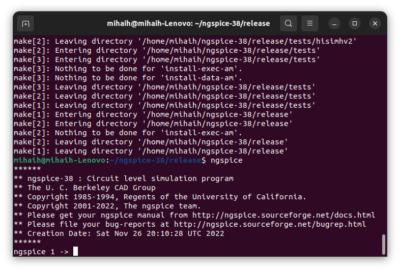

# VSDhdp

# Tools install

### Yosys
```
$ git clone https://github.com/YosysHQ/yosys.git
$ cd yosys-master 
$ sudo apt install make (If make is not installed please install it) 
$ sudo apt-get install build-essential clang bison flex \
    libreadline-dev gawk tcl-dev libffi-dev git \
    graphviz xdot pkg-config python3 libboost-system-dev \
    libboost-python-dev libboost-filesystem-dev zlib1g-dev
$ make 
$ sudo make install

```


### OpenSTA

https://github.com/The-OpenROAD-Project/OpenSTA'

|    -    | from  |Ubuntu  | On my machine
|    ---|---|---|---
|     -   |       |18.04.1|  20.4
|cmake   | 3.10.2 |3.10.2  |3.22.1
|clang   |9.1.0   |        |14.0.0
|gcc     |3.3.2   |7.3.0   |11.3.0
|tcl     |8.4     |8.6     |8.6.11+1build2
|swig    |1.3.28  |3.0.12  |4.0.2
|bison   |1.35    |3.0.4   |3.8.2
|flex    |2.5.4   |2.6.4   |2.6.4


### ngspice

After downloading the tarball from https://sourceforge.net/projects/ngspice/files/ to a local directory, unpack it using:

$ tar -zxvf ngspice-xx.tar.gz
$ cd ngspice-xx
$ mkdir release
$ cd release
$ ../configure  --with-x --with-readline=yes --disable-debug
$ make
$ sudo make install



# Day 1 - Introduction to Verilog RTL design and Synthesis
  - Introduction to open-source simulator iverilog
  - Labs using iverilog and gtkwave
  - Introduction to Yosys and Logic synthesis
  - Labs using Yosys and Sky130 PDKs

