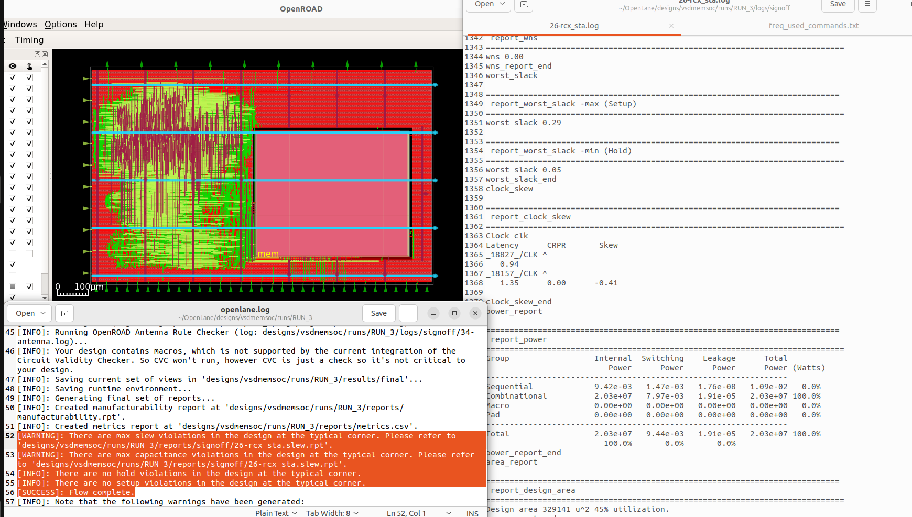

# Table of content  
+ [Overview](#functional-diagram)
+ [Project status 230130](https://github.com/MihaiHMO/VSDhdp/blob/main/vsdmemsoc_prj/Status_230130.md)
	+ First RTL and GLS synthesis  
	+ CTS Design Constrains and STA Analisys
	+ Physical design
+ [Project status 2300210]
	+ Physical design 


# Physical implementation of VSDMemSoC

The project scope is to implement using Skywater sky130 PDK the RTL of [VSDMemSoc](https://github.com/vsdip/VSDMemSoC) witch contains a [Risc-V CPU](https://github.com/RISCV-MYTH-WORKSHOP/riscv_myth_workshop_nov22-MihaiHMO/settings) connected to a [open source SRAM](https://github.com/vsdip/vsdsram_sky130)  

## Functional diagram   
  

## Final Implementation
Test bench


Layout


Stats:
	- Die area: 1100 x 700 ->  
	- Design area: 329141 u^2 45% utilization 
	- Flop ration: 0.178  
	- TNS: 0 ns   
	- WNS: 0 ns   
	- CLK Skew: -0.41 ns  
	- Violantions :  max slew and cap @SRAM interface
```
 report_power
============================================================================
Group                  Internal  Switching    Leakage      Total
                          Power      Power      Power      Power (Watts)
----------------------------------------------------------------
Sequential             9.42e-03   1.47e-03   1.76e-08   1.09e-02   0.0%
Combinational          2.03e+07   7.97e-03   1.91e-05   2.03e+07 100.0%
Macro                  0.00e+00   0.00e+00   0.00e+00   0.00e+00   0.0%
Pad                    0.00e+00   0.00e+00   0.00e+00   0.00e+00   0.0%
----------------------------------------------------------------
Total                  2.03e+07   9.44e-03   1.91e-05   2.03e+07 100.0%
                         100.0%       0.0%       0.0%
```
