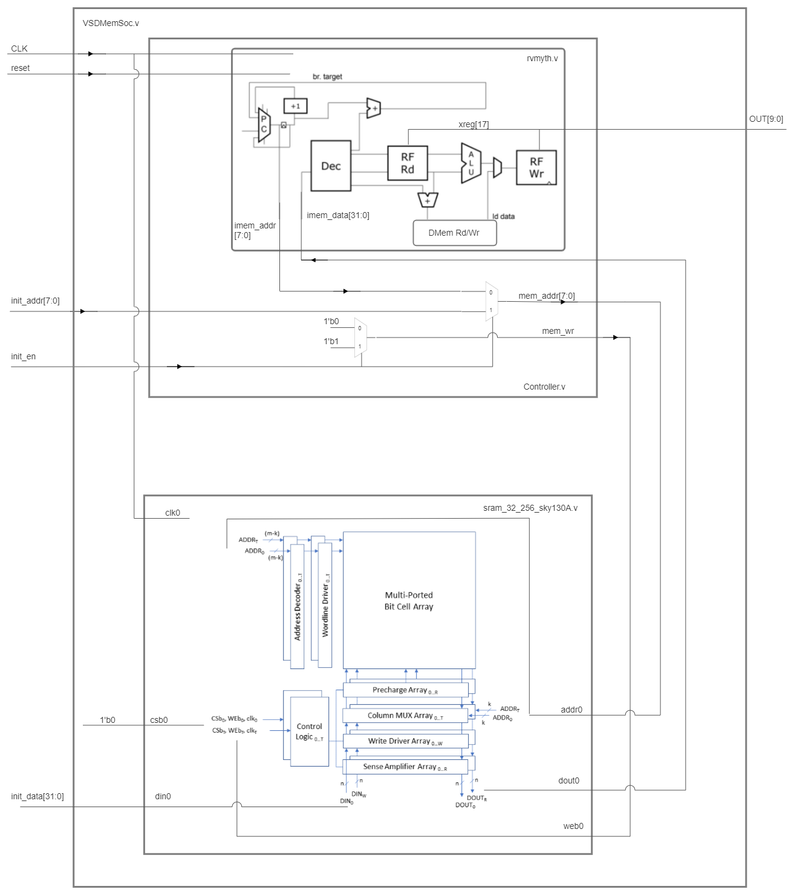
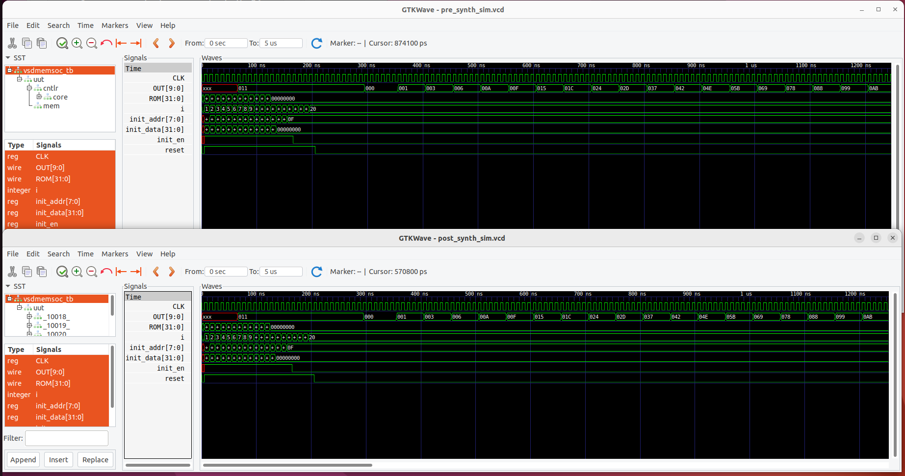

# Table of content  
- [Overview](#functional-diagram)  
- [Make commands](#make-commands)  
- [RTL and GLS synthesis](#rtl-and-gls-synthesis)  
- [CTS Design Constrains and STA Analisys](#cts-design-constrains-and-sta-analisys)  

# Physical implementation of VSDMemSoC

The project scope is to implement using Skywater sky130 PDK the RTL of [VSDMemSoc](https://github.com/vsdip/VSDMemSoC) witch contains a [Risc-V CPU](https://github.com/RISCV-MYTH-WORKSHOP/riscv_myth_workshop_nov22-MihaiHMO/settings) connected to a [open source SRAM](https://github.com/vsdip/vsdsram_sky130)  

## Functional diagram   
  

## Folder structure
```
├── gds                 # SRAM GDS Model.
├── gls_model           # SKY130 PDK Verilog files
├── include             # include files for SOC Modeling
├── lib                 # SKY130 Standard cells and SRAM lib files
├── module              # SOC Verilog files, beside rvmyth.v
├── output              # Output files Produced during runtime, including rvmyth.v file
|   ├── compiled_tlv
|   ├── synth
|   ├── pre_synth
|   ├── post_synth
|   ├── sta
├── scripts             # Scripts for: yosys
├── Makefile            # Makefile for executing steps during design flow
└── 

```
## Make Commands

- `clean` Removes the output Directory
- `tlv` Generates verilog files from tlv using sandpiper
- `pre_synth_sim` RTL Simulation using iverilog
- `synth` Synthesizes netlist using YOSYS, report can be fout in output/synth folder
- `post_synth_sim` GLS Simulation using iverilog
- `sta` STA Design constrains and reports

### tlv
The _rvmyth_ a 4 stage RV32I Risc-V core was originally designed in TLV langueage using Makerchip online IDE.  
A convertion from TLV to verilog is needed.    
Convertion of TLV to Verilog of **_rvmyth_** core : `sandpiper-saas -i module/rvmyth.tlv -o rvmyth.v --bestsv --noline -p verilog --outdir output/compiled_tlv`  
    - `-i` - <tlv-[m4]in-file >: TLV input file>  
    - `o` - < tlv-out-file >: SV ouput file  
    - `--bestsv` - Optimize the readability/maintainability of the generated SV, unconstrained by correlation w/ TLV source.  
    - `--noline` - Disable line directive in SV output  
    - `-p` - Project name, corresponding to project configuration directory (e.g. -p verilog). (default: default)   
    - `verilog`  
    - `--outdir` - A root directory for all produced files as a relative or absolute path  

## RTL and GLS synthesis


    

## CTS Design Constrains and STA Analisys

Inputs delays: min 0.5
Input transition 

|CLOCKS	|frequency	|duty_cycle	|min_rise_delay	|min_fall_delay	|max_rise_delay	|max_fall_delay	|min_rise_slew	|min_fall_slew	|max_rise_slew	|max_fall_slew	
|-	|-	|-	|-	|-	|-	|-	|-	|-	|-	|-										
|clk	|10	|50	|1	|1	|1	|1	|1	|1	|1	|1	
											
											
|INPUTS	|early_rise_delay |early_fall_delay	|late_rise_delay |late_fall_delay |early_rise_slew |early_fall_slew	|late_rise_slew	|late_fall_slew	|clocks |bussed	|bus width 
|- |-	|- |-	|- |-	|- |-	|- |-	|- |-  
|reset |0.5	|0.5 |1	|1 |0.5	|0.5 |1	|1 |clk	|no |										
|init_en |0.5 |0.5	|1	|1	|0.5 |0.5 |1 |1	|clk |no |  
|init_addr |0.5 |0.5 |1	|1 |0.5	|0.5 |1	|1 |clk	|yes |8  
|init_data |0.5	|0.5 |1	|1	|0.5 |0.5 |1 |1	|clk |yes |32  
																					
											
|OUTPUTS	|early_rise_delay	|early_fall_delay	|late_rise_delay	|late_fall_delay	|clocks	|load	|bussed	|bus width			
|-	|-	|-	|-	|-	|-	|-	|-	|-	 
|OUT	|0.5	|0.5	|1	|1	|clk	|1	|yes	|10	 	


**STA Analisys report**

`report_net -connections _33531_`   - check the fanout cells  
`replace_cell <instance> <name_new_cell>` -replace a specific instance cell buffers with bigger variants

Timing variation vs PVT for the same start/endpoint pair:


### Physical Design 
**SRAM Cell**
file:///home/mihaih/Pictures/Screenshots/Screenshot%20from%202023-01-25%2017-02-20.png
Area: 205521.531 um^2 -> 0.2055mm^2

OpenLane version : 06b26813465d8745c2cdfe6605ac3233cef89dec
Open_pdks: 327e268bdb7191fe07a28bd40eeac055bba9dffd
OpenROAD: 4f1108b6f558718ed142cbb6c1f5ba20958195ca

Design setup :
```
# go to OpenLane dir
$ sudo make mount

#create design
$ ./flow.tcl -design vsdmemsoc -init_design_config -add_to_designs

```
Config file:
```
{
    "DESIGN_NAME": "vsdmemsoc",
    "VERILOG_INCLUDE_DIRS": "dir::src/include",
    "VERILOG_FILES": ["dir::src/module/*.v", "dir::src/module/compiled_tlv/rvmyth.v"],
    "EXTRA_LEFS":"dir::src/lef/*.lef",
    "EXTRA_GDS_FILES": "dir::src/gds/*.gds",
    "EXTRA_LIBS": "dir::src/lib/sram_32_256_sky130A_TT_1p8V_25C.lib",
    "VERILOG_FILES_BLACKBOX": "dir::src/include/sram_32_256_sky130A.v",
    
    "CLOCK_PORT": "CLK",
    "CLOCK_PERIOD": 10.0,
        
    "VDD_NETS": "vccd1",
    "GND_NETS": "vssd1",

    "FP_PDN_MACRO_HOOKS": "vsdmemsoc.mem vccd1 vssd1 vccd1 vssd1",
    "BASE_SDC_FILE": "dir::src/sdc/vsdmemsoc_synth.sdc",
    "SYNTH_SIZING": 1,
    "SYNTH_FLAT_TOP": 1,
     
    "ROUTING_CORES": 4,

    "MAGIC_DRC_USE_GDS": false,
    "QUIT_ON_MAGIC_DRC": false,
    "RUN_KLAYOUT_XOR": false,
    "DESIGN_IS_CORE": true
}
```
Define SDC: 
Cap load extracted from ".lib" file

At the beginnig a synthesis strategy eploration can be done by open lane with : `$ ./flow.tcl -design vsdmemsoc -synt_explore`
The output is an Area estimation and syhtesised verilog file for diferent strategies:


Open design: `prep -design vsdmemsoc - tag RUNxxx [-overwrite]` 

Insert custom SRAM cells: 
```
set lefs [glob $::env(DESIGN_DIR)/src/lef/*.lef]
add_lefs -src $lefs

```
run_synthesis 
Check die area, flop ration, slack, tns , wns
```
 $ run synthesis
 # check result netlist: runs/RUN_<date>_<time>/synthesis/<deisgn>.v
 # check synth-stat report:                    /reports/synthesis/1-synthesis.AREA_0.stat.rpt
 # check timing report:                        /logs/synthesis/2-sta.log
```
run_floorplan

run_placement
```
 % run placement
  # result in <design>/runs/<date>_<time>/results/placement/
```
